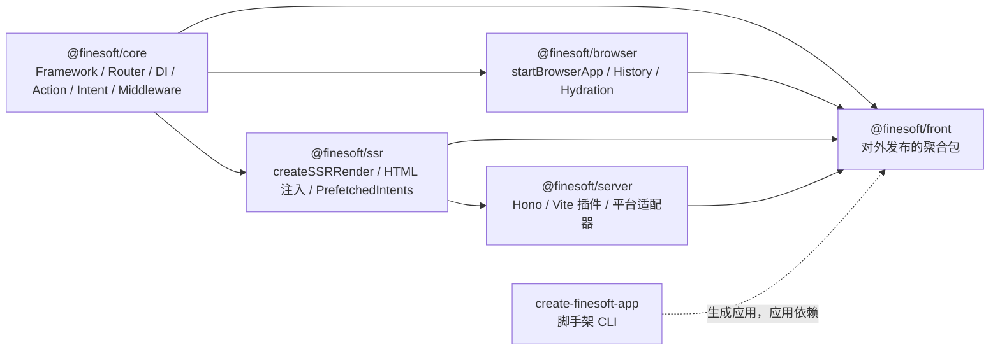
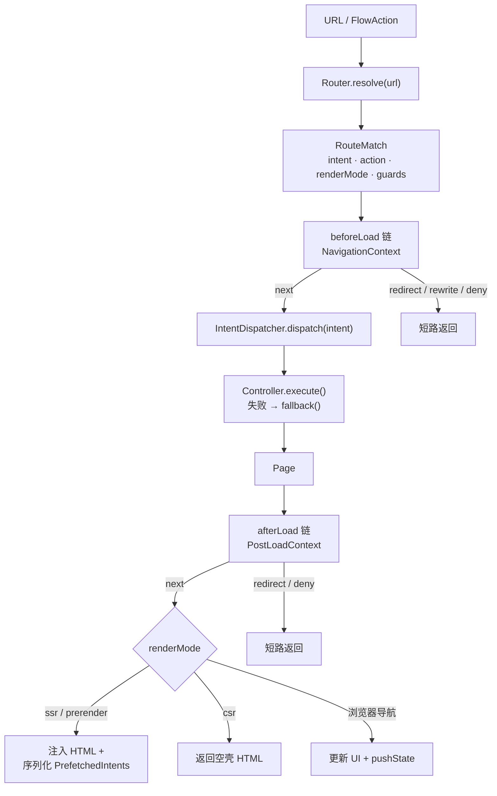
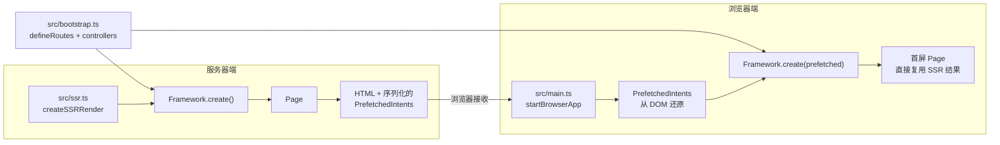

# CLAUDE.md

本文件为 Claude Code (claude.ai/code) 在该仓库中工作时提供指引。

这是一份速查参考。完整的项目规范（含必须遵守的 Vite+ 工作流章节）见 [AGENTS.md](./AGENTS.md)。

## 工具链：Vite+ (`vp`)

本项目使用 **Vite+** —— 一个统一的工具链，把 Vite、Rolldown、Vitest、tsdown、Oxlint、Oxfmt 包装在全局 CLI `vp` 之下。**不要直接调用 `pnpm`、`npm`、`vitest`、`oxlint` 或 `tsdown`。**

```bash
vp install          # 安装依赖（拉取代码后先运行）
vp dev              # 开发服务器
vp check            # 格式化 + lint + 类型检查（提交前必跑）
vp test             # 运行 Vitest 测试
vp test --coverage  # 覆盖率输出到 reports/coverage/
vp run -r build     # 按依赖顺序构建所有包
vp ready            # fmt + lint + build（完整校验）
vp run <script>     # 执行 package.json 脚本（注意不是 vp <script>）
```

跑单个测试文件：`vp test path/to/file.test.ts`；按用例名过滤：`vp test -t "用例名"`。

### 导入约定

始终从 `vite-plus` 导入，不要从 `vite` 或 `vitest` 导入：

```ts
import { defineConfig } from "vite-plus";
import { expect, test, vi } from "vite-plus/test";
```

仓库根目录下独立的 `.oxlintrc.json` 与 `.oxfmtrc.json` 是 pre-commit hook 所必需的（hook 加载不了 `vite.config.ts`）—— 修改 Vite+ 配置时要保持两边同步。

## 仓库结构

pnpm workspace 单仓多包：`packages/*` 与 `templates/*`。Node 要求 `>=22.12.0`，pnpm `10.33.0`。



| 包           | 职责                                                                                           |
| ------------ | ---------------------------------------------------------------------------------------------- |
| `core`       | `Framework`、`Router`、DI `Container`、`ActionDispatcher`、`IntentDispatcher`、中间件管线      |
| `browser`    | `startBrowserApp`、history、action 处理、SSR 数据 hydration                                    |
| `ssr`        | `createSSRRender`、HTML 注入、`PrefetchedIntents` 序列化                                       |
| `server`     | Hono 应用、Vite 插件 (`finesoftFrontViteConfig`)、平台适配器（Node/Vercel/Cloudflare/Netlify） |
| `front`      | **对外发布**的包 —— 把上面四个内部包聚合成单一导入面                                           |
| `create-app` | 脚手架 CLI 的源码                                                                              |

应用代码只应该从 `@finesoft/front` 导入。

## 架构

### 请求生命周期

1. `Router.resolve(url)` → `RouteMatch { intent, action, renderMode, guards }`
2. `beforeLoad` 中间件（`NavigationContext`）—— 第一个非 `next()` 的返回值会短路后续中间件
3. `IntentDispatcher.dispatch(intent)` → controller → `Page`
4. `afterLoad` 中间件（`PostLoadContext`，此时已有 Page）
5. SSR：把 prefetch 数据注入 HTML；CSR：更新 UI 并 `pushState`



同一份 `bootstrap()`（路由定义 + controller 注册）在服务器与浏览器都会执行，所以路由解析和 intent 派发在 SSR/CSR 之间完全一致。SSR 把 prefetch 出来的 intent 结果序列化进 HTML，浏览器再把它们读回 `PrefetchedIntents`，让首次客户端导航直接复用服务器结果，不必重新发请求。



### 关键抽象

- **`Framework`** —— 中央编排者；持有 Container、Router、ActionDispatcher、IntentDispatcher；对外暴露 `getLocale()`、`getPlatform()`、`didEnterPage()`。
- **`BaseController<TParams, TResult>`** —— 抽象 intent 处理器，内置 try/catch → `fallback(params, error)` 兜底机制。
- **中间件** —— 两阶段管线（`beforeLoad`、`afterLoad`）；guard 返回 `next() | redirect() | rewrite() | deny()`。
- **`ActionDispatcher`** —— 处理 `FlowAction`（SPA 内跳）、`ExternalUrlAction`、`CompoundAction`（递归）。
- **`Container`** —— DI 容器，使用 `DEP_KEYS` 常量做命名注册；`createScope()` 创建请求级子作用域，未注册的 key 会回落到父容器。
- **`PrefetchedIntents`** —— SSR → CSR hydration 缓存，使用稳定 stringify。
- **`EventRecorder`** —— 可组合的结构化事件记录（`ConsoleEventRecorder`、`CompositeEventRecorder`、`WithFieldsRecorder`）。
- **`HttpClient`** —— 抽象 HTTP 客户端，支持请求/响应拦截器；失败时抛 `HttpError`。
- **`Translator` / `SimpleTranslator`** —— 国际化，支持 ICU 插值和复数规则。
- **`ReportingLoggerFactory`** —— 通过 `reportCallback` 把 `warn`/`error` 日志转发到外部监控。

### 标准 `DEP_KEYS`

`LOGGER`、`LOGGER_FACTORY`、`NET`、`STORAGE`、`FEATURE_FLAGS`、`METRICS`、`FETCH`、`EVENT_RECORDER`、`LOCALE`、`PLATFORM`。

### 渲染模式

`"ssr"`（默认）、`"csr"`（服务器只返回空壳 HTML）、`"prerender"`（构建期静态化 + ISR）。

## 代码规范

- TypeScript **strict 模式**，target/module 都是 ESNext。
- 公共契约用 `interface`；可辨识联合用 `type`。
- 类型守卫用 `is*` 前缀（`isFlowAction`、`isCompoundAction`）。
- 工厂函数用 `create*` / `make*`（`createServer`、`makeFlowAction`）。
- 常量用 `SCREAMING_SNAKE_CASE`（`ACTION_KINDS`、`DEP_KEYS`）。
- 上下文接口字段保持 `readonly`。
- 所有包都同时产出 ESM + CJS 加 `.d.ts`（仅 `server` 不输出 DTS）。`front` 使用 tsdown 的 `noExternal: [@finesoft/*]` 把内部包打到一起。
- 每个包都有自己的 `tsdown.config.ts` —— 注意 external/noExternal 的边界。
- **`front` 包有发布前后置脚本**（`scripts/prepare-front-publish.mjs`、`scripts/restore-front-publish.mjs`）会改写它的 `package.json`（移除 workspace devDeps、内联 file 列表）。改动这套流程前必须同时理解 `prepack` 和 `postpack` —— 它们必须保持对称。

## 发布流程

```bash
changeset                                              # 创建 changeset
vp run -r build && changeset publish --access public   # 发布（只发 front，其它是私有）
```

只有 `@finesoft/front` 会被发布。`core`、`browser`、`ssr`、`server`、`create-app` 都是 `"private": true`，通过 `front` 这个聚合包间接对外。

## 覆盖率 / CI

`Quality` GitHub Actions workflow 会跑 `vp check` 和 `vp test --coverage`；`CodeQL` 在定时任务和 PR 时运行。覆盖率与 CodeQL 的扫描范围：`packages/{core,browser,ssr,server,front}/src/**`。测试、模板、文档、脚本、`create-app` 都排除在外。
