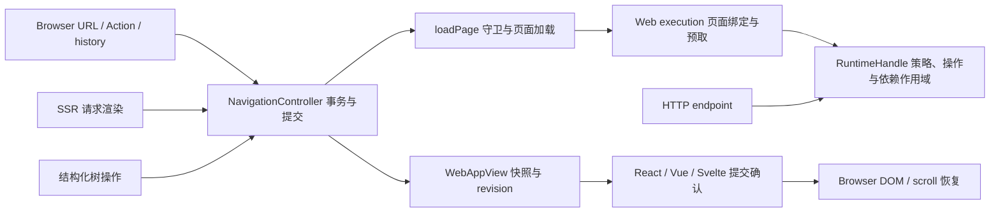

# 保留全部能力的大架构改写验证（2026-09-20）

后续范围修正：此前确认的设计允许公开 API 调整和消费者迁移。下文实测保留为固定原有模型和 API 的原型结论，不能把声明逐字节不变扩展为所有未来架构的前提。新的职责与数据模型收敛候选见[高层架构设计](superpowers/specs/2026-09-20-model-consolidation-design.md)，尚未实施。

**本轮没有证明“保留全部能力并减少一半以上源码”可行。已经做出的统一导航树内核原型应当拒绝：它增加源码、改变可观察行为，并使多项遍历变慢。** 导航编排合并、SSR/HTTP 生命周期合并也没有找到足够规模的重复实现。这个结论只适用于本轮审查和实测的候选，不是对所有未来架构的不可行性证明。

本轮完成契约盘点、调用链与状态归属审查、隔离原型、差分验证和微基准。原型未应用到主工作区。此前 Action/modal、非结构化 URL 导航、markPublic、请求隔离、原生渲染器等修复仍保留。

## 基线与验收线

验证基线是本地检查点 `c7b9f7b226e1d9ac40135f1b93aa5e04e85ef9d4`，创建于此前的 `refactor/reduce-runtime` 隔离工作区。检查点包含之前的修复和等价去重；验证开始时，730 个受版本控制或未被忽略的文件与主工作区一致。主工作区的未提交内容没有被覆盖。

候选分支为 `research/architecture-proof`，工作区为 `.worktrees/architecture-proof`，唯一运行源码修改是 `packages/web/src/navigation/operations.ts`。没有新增运行依赖，没有把实现搬到模板或生成文件来计算降幅。

沿用原目标的统计口径：`core/web/browser/ssr/server/front` 六个包的 `src`，排除测试、文档、声明产物、构建输出。原目标基线为 **13,870 行**；当前稳定基线为 **13,765 行**。超过 50% 的降幅要求最终至多 **6,934 行**，即还需至少净减少 **6,831 行**。

| 当前包  | 源码行数 |
| ------- | -------: |
| core    |    3,347 |
| web     |    4,895 |
| browser |    2,051 |
| ssr     |      532 |
| server  |    2,700 |
| front   |      240 |
| 合计    |   13,765 |

保留能力的门槛是接口、行为、生命周期、稳定性和性能同时成立；公开名称和声明相同只是其中一项。减少物理行也必须同时检查非注释词法单元与源码字节，避免通过排版获得虚假的减量。

## 能力清单与证据边界

[机器可读契约清单](../reports/architecture-proof/contracts.json)记录 11 个公共入口、30 组行为契约，以及对应源码、测试和已知缺口。主要包括：

- 操作定义、schema/policy、调用取消、查询合并/失效、provider 生命周期及所有权。
- 非结构化 URL 与树导航、before/afterLoad、重写与重定向、栈/tabs/split、Action/modal、自定义及复合 action、entry 复用。
- markPublic/public projection、预取、水合、session、草稿、隐藏页面身份与恢复。
- React/Vue/Svelte 原生 Outlet、提交 revision、DOM/scroll 恢复、多实例及 SSR/CSR/prerender。
- HTTP 流、Node/Worker、后台任务、部署生成器、代理及出站请求边界。
- 日志、事件、国际化和平台工具，以及公共入口隔离。

这份清单是能力与证据的映射，不是“30 组全部重新测试通过”。本轮候选在较早的行为、性能和减量门槛失败，因此没有继续运行完整浏览器矩阵、真实网络流断连和长期负载验证，也没有宣称它保留了框架全部能力。

## 架构审查：实际能删掉什么

| 候选                          | 当前调用链与不可省略的工作                                                                                                                                       | 本轮判断                                                                                                    |
| ----------------------------- | ---------------------------------------------------------------------------------------------------------------------------------------------------------------- | ----------------------------------------------------------------------------------------------------------- |
| 统一导航控制器与 Browser 编排 | `createNavigationController → resolveTree → resolveCandidate → loadPage` 已共用一条页面加载链。Browser 另管 admission、history、modal、native commit 和 DOM 恢复 | 没有找到两套可互相替代的页面引擎。初审的数百行减量估计在核对公开接口和调用链后撤回                          |
| 把 `loadPage` 内联进控制器    | `loadPage` 仍是公共导出；既有守卫、错误与重定向结果契约必须保留                                                                                                  | 仅内联调用处不能删除公开实现，增加兼容包装也要计入成本                                                      |
| 合并 SSR/HTTP 请求生命周期    | SSR 要在请求资源释放前完成 HTML 和 public hydration 数据物化；HTTP 流需要保留资源到消费、取消或失败；后台任务又有独立生命周期                                    | 外形相似的 try/finally 和 Promise 跟踪不是等价生命周期。只有小段 owner 跟踪存在潜在共享空间，未支持大幅减量 |
| 统一树遍历与路径重建          | active、visible、all、reuse 的顺序、早停、结构共享与祖先修改不同                                                                                                 | 已实现并测量，结果增加代码、存在行为回归和性能退化，拒绝原型                                                |

导航控制器的入口在 `packages/web/src/navigation/controller.ts:335`，统一解析在 `resolveTree:378`、`resolveCandidate:418`，调用 `loadPage` 在第 495 行。`loadPage` 自身位于 `packages/web/src/application/load-page.ts:40`。`createAppView` 的 revision/commit 协议与页面结果身份仍有独立用途，不能仅因也持有快照就当作控制器的重复缓存。



该图表示现有调用关系，不是另一套待实施的分层。Core 的调用内并发记录、runtime 查询缓存与 Web 的页面保留状态也有不同的键、作用域和失效时机；把这些 Map 合成一个容器并不会消除其语义。

SSR 资源边界可从 `packages/ssr/src/create-render.ts`、`render-owner.ts` 和 `packages/server/src/ssr-host.ts` 追踪；HTTP 响应所有权在 `packages/server/src/http.ts:266` 的 `ownResponse`。这部分结论来自源码和已有测试契约审查，未实现一个新的统一 RequestScope 来冒充运行验证。

## 已执行原型：统一导航树内核

原型用 `visitTree(mode, visit)` 统一 active/visible/all/reuse 遍历，用 `rebuildPath` 加不同父节点重建策略统一路径编辑。`mapNavigationLeaves` 必须保留对整个树的重建语义，因此仍需要单独实现。这些额外模式、回调和路径对象就是替换成本，不能只统计删掉的旧分支。

[完整补丁](../reports/architecture-proof/tree-kernel.patch)与[实验说明](../reports/architecture-proof/tree-kernel-notes.md)已保存。格式化后测量如下：

| 指标                 | 稳定基线 |    原型 | 净变化 |
| -------------------- | -------: | ------: | -----: |
| `operations.ts` 行数 |      599 |     648 |    +49 |
| 六包运行源码行数     |   13,765 |  13,814 |    +49 |
| 非注释词法单元       |   76,577 |  76,851 |   +274 |
| 源码字节             |  527,245 | 528,874 | +1,629 |
| 源文件               |      148 |     148 |      0 |

没有删除注释或压缩排版来补足目标。六套模板没有修改。[原始源码测量](../reports/architecture-proof/measurements.json)保留每个文件的哈希。

### 接口与常规测试

- `vp install` 完成；稳定基线和候选均完成 17 个项目的构建。
- 候选 `vp check` 通过：格式、lint、类型检查无警告或错误。
- 候选格式化后，原有导航操作测试 **81/81 通过**。
- 11 个公共入口及其共享块，共 **20 个 `.d.mts` 文件逐字节一致**。
- 可由 Node 直接加载的 10 个公共入口，实际运行时导出名称一致。
- Svelte 入口需要原生编译器；其 `svelte.mjs`、`Outlet.svelte`、`Outlet.svelte.d.ts` 逐字节一致，模板构建通过。没有把原始 Node loader 不支持 `.svelte` 误报为框架缺陷或成功的导入测试。

接口与构建通过，并没有消除下面的反例。

### 差分与边界反例

[对照脚本](../reports/architecture-proof/verify-tree-kernel.mjs)以固定种子 `1594468115` 生成 500 个树，对比返回值、输入引用复用、输出别名关系、异常和回调顺序；输入被冻结，以检测意外写入。15 个方法来自实际公共构建入口，内部 `reuseEntry` 则由 Vite 单独构建源模块，避免为了测试扩大公共 API。

**41,261 次对照出现 1 处不等价**：`reuseEntry` 访问带 getter 的 tabs branches 时，稳定实现的顺序为 `first → first → later`，候选为 `first → later`。两边在该探针中最终抛出同一错误，但 getter 的可观察调用顺序已变。公开树结构没有要求只能传入不含 accessor 的 JSON 对象。

[深度探针](../reports/architecture-proof/verify-tree-boundaries.mjs)另用普通数据对象构造嵌套 stack。深度 32、256、1,024、4,096 两边都成功；深度 **8,192** 时旧实现成功，新实现抛 `RangeError: Maximum call stack size exceeded`。原因是原先迭代执行的 active 路径改用了递归 walker。这是压力边界反例，不代表日常页面有如此深的树，也不代表旧框架的所有操作都支持这一深度。

为确认对照工具确实能发现错误，还运行了：

- 基线与自身对比：41,261 次全部通过。
- 故意以 visible 集合替代 all 集合：2,012 次对照内检出 12 处差异，按设定停止。
- 故意破坏 pop 的引用共享：48 次对照内检出 12 处差异，按设定停止。

探针开发中先发现内部 `reuseEntry` 不能从公共入口导入，随后加入入口存在性断言和单独构建，再重跑了上述对照及负向控制。早期把双方缺失函数都抛错视为相同的结果没有纳入有效证据。

完整结果在 [差分数据](../reports/architecture-proof/tree-kernel-differential.json)和[接口/深度数据](../reports/architecture-proof/tree-kernel-boundaries.json)。

### 微基准

Node v24.21.0，同一进程、同一个 100 节点测试树，每个方法每侧预热 5,000 次，7 轮交替顺序，每轮每侧 20,000 次；轮间显式 GC。下表为每次调用的中位微秒数。

| 操作                       | 稳定基线 μs | 原型 μs | 原型 / 基线 |
| -------------------------- | ----------: | ------: | ----------: |
| collectAllLeaves           |       1.107 |   6.705 |       6.06× |
| collectVisibleDestinations |       0.058 |   0.530 |       9.17× |
| mapNavigationLeaves        |       1.717 |   1.723 |       1.00× |
| reuseEntry 首条命中        |       0.196 |   0.822 |       4.20× |
| reuseEntry 末条命中        |       1.318 |   6.181 |       4.69× |
| resolveActivePath          |       0.035 |   0.400 |      11.54× |

原始数据含各轮样本、最小/最大值：[性能数据](../reports/architecture-proof/tree-kernel-differential-performance.json)。这是具体算法的局部微基准，不能解释为整页导航慢了 4～12 倍，也没有测量长期内存泄漏。源码审查可见，新实现为访问节点创建 cursor、复制路径并创建子节点数组，而旧路径没有相同的分配需求；该解释没有冒充堆分配 profiler 的结果。

## 决策与仍未证明的部分

拒绝把当前统一树内核应用到 main，依据是 **行为不等价、压力边界退化、微基准退化、代码量增加**，不依赖全量测试是否仍能通过。继续修补这个原型也不能把现有结果报告成达成减量目标。

导航事务已有公共加载链；SSR/HTTP 的资源释放时点必须保留。已审查范围没有形成一个能净删 6,831 行的候选，因此不启动没有具体删除对象与替换成本的大规模生产重写。

未来若出现新的具体架构候选，仍需先说明旧实现中哪部分工作被实际消除、哪些兼容代码必须保留，并按本轮契约清单逐步证明。通过入口/类型门槛之后，还要通过受影响行为对照、真实 native commit/session/stream 路径及性能门槛，再运行完整构建与回归。当前证据不能宣称“全部能力已证明保留”，也不能宣称“任何大改写都无法达到 50%”。

主工作区运行源码本轮没有新增改动，仍为 13,765 行；既有修复和上一批 105 行减量保留。候选仅保存在实验工作区和补丁中，未合并、未推送、未发布。

## 复现

保留当前主工作区基线构建和 `.worktrees/architecture-proof` 候选构建后，在仓库根执行：

```bash
vp exec node --expose-gc reports/architecture-proof/verify-tree-kernel.mjs \
  . .worktrees/architecture-proof \
  reports/architecture-proof/tree-kernel-differential.json --bench

vp exec node --expose-gc reports/architecture-proof/verify-tree-boundaries.mjs \
  . .worktrees/architecture-proof reports/architecture-proof
```

第一个命令预期因已知差分失败退出 1，同时保存差分和性能结果；第二个命令保存声明、入口与深度比较，它的退出 0 仅表示数据采集成功，应读取 `depths[].equal` 判断等价性。若主工作区后来继续变化，基线需改为 `c7b9f7b` 的独立检出并先执行 `vp install`、`vp run -r build`。
