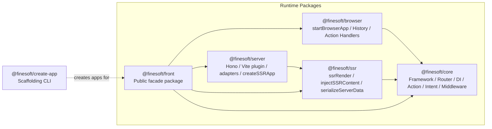
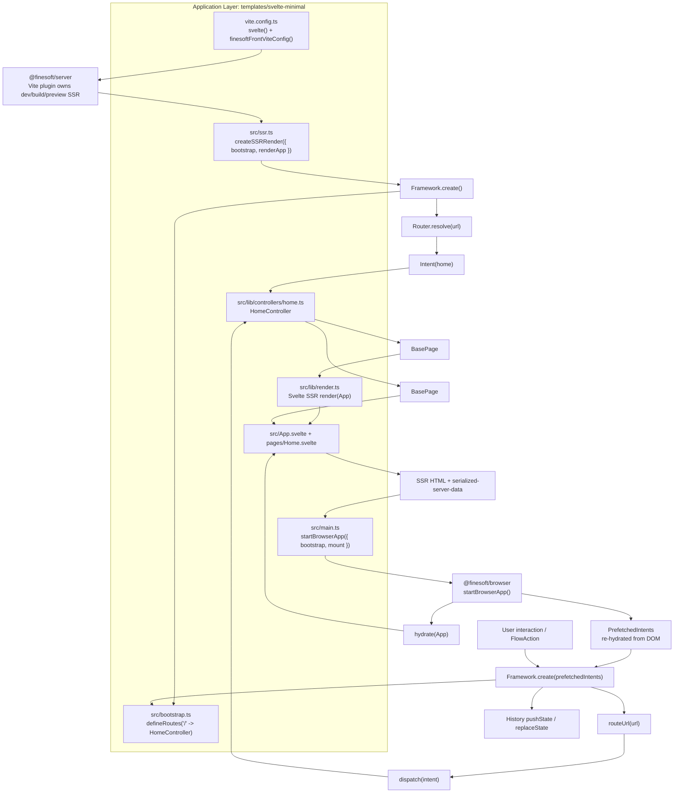

# Architecture

This document expands the high-level package view from the root README and shows how the runtime pieces fit together in a real application.

The application example below uses [`templates/svelte-minimal`](../templates/svelte-minimal).

## Package Architecture

### Notes

- `@finesoft/front` is the only package application code usually imports. It re-exports the internal packages as a single public API surface.
- The browser runtime depends on `@finesoft/core`.
- The server runtime depends on `@finesoft/ssr`, which depends on `@finesoft/core`.
- `@finesoft/create-app` is not part of runtime execution. It only scaffolds projects that consume `@finesoft/front`.

## Application Architecture

The diagram below shows the actual runtime shape of the Svelte minimal template.

### What Is Shared Between SSR And CSR

- `src/bootstrap.ts` is shared by both the server render path and the browser startup path.
- The same controller set is registered for SSR and CSR, so route resolution and intent dispatch stay consistent.
- Controllers return framework-level page models (`BasePage`), while the application decides how to render them with Svelte, React, or Vue.
- SSR serializes prefetched intent results into the HTML, and browser startup reads them back into `PrefetchedIntents` so the first client navigation can reuse the server result instead of fetching again.

## Key Files

| File                                                                                        | Responsibility                                                                                  |
| ------------------------------------------------------------------------------------------- | ----------------------------------------------------------------------------------------------- |
| [`packages/core/src/framework.ts`](../packages/core/src/framework.ts)                       | Core runtime orchestration: container, router, action dispatcher, intent dispatcher, middleware |
| [`packages/browser/src/start-app.ts`](../packages/browser/src/start-app.ts)                 | Browser bootstrap, hydration startup, action handler registration                               |
| [`packages/ssr/src/render.ts`](../packages/ssr/src/render.ts)                               | Shared SSR pipeline: route, middleware, dispatch, render                                        |
| [`packages/server/src/app.ts`](../packages/server/src/app.ts)                               | Hono SSR app, template loading, HTML injection, render mode handling                            |
| [`packages/server/src/vite-plugin.ts`](../packages/server/src/vite-plugin.ts)               | Vite integration for dev, build, preview, and adapter output                                    |
| [`templates/svelte-minimal/src/bootstrap.ts`](../templates/svelte-minimal/src/bootstrap.ts) | Route definitions and controller registration                                                   |
| [`templates/svelte-minimal/src/main.ts`](../templates/svelte-minimal/src/main.ts)           | Browser entry: starts hydration and mounts the app                                              |
| [`templates/svelte-minimal/src/ssr.ts`](../templates/svelte-minimal/src/ssr.ts)             | SSR entry: wires `createSSRRender()` to the application renderer                                |
