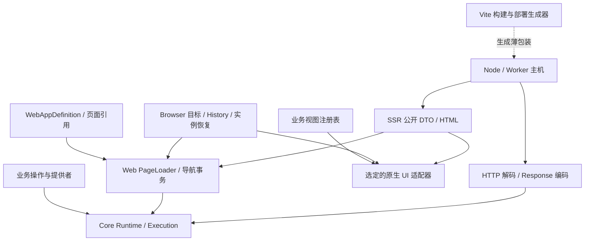
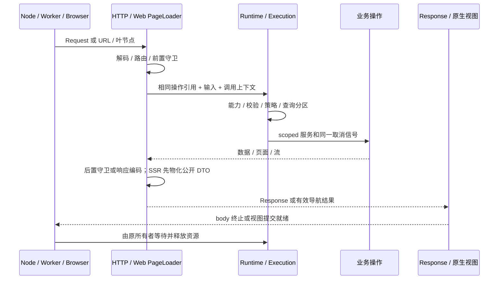

# 应用架构：职责、执行和实际成本

本次改造把通用操作、Web 页面、浏览器实例、SSR 与主机边界拆开，并让普通应用通过声明和原生渲染适配器装配。验证包括本地 Node、workerd、真实浏览器 Worker、React/Vue/Svelte 和独立安装的发布产物。完整命令、产物与限制见 [联合验收](application-boundaries-acceptance.md)。本地验收不代表发布或线上部署。

## 分层与公开入口


```mermaid
flowchart TB
  OP[业务操作与提供者] --> CORE[Core Runtime / Execution]
  APP[WebAppDefinition / 页面引用] --> WEB[Web PageLoader / 导航事务]
  VIEW[业务视图注册表] --> UI[选定的原生 UI 适配器]
  BROWSER[Browser 目标 / History / 实例恢复] --> WEB
  BROWSER --> UI
  SSR[SSR 公开 DTO / HTML] --> WEB
  SSR --> UI
  WEB --> CORE
  HTTP[HTTP 解码 / Response 编码] --> CORE
  HOST[Node / Worker 主机] --> HTTP
  HOST --> SSR
  BUILD[Vite 构建与部署生成器] -.生成薄包装.-> HOST
```

| 公开导入                                         | 所有者和边界                                                                                     |
| ------------------------------------------------ | ------------------------------------------------------------------------------------------------ |
| `@finesoft/front`                                | portable Core：操作、定义、Runtime、Execution、DI、契约与纯工具；没有 Page/DOM/Node/Vite/UI 依赖 |
| `/web`                                           | Web 定义、页面加载、路由与导航树、会话状态契约；不拥有 DOM                                       |
| `/browser`                                       | 显式 DOM 目标、History、启动/恢复/销毁；不导入 Node 或 Vite                                      |
| `/ssr`                                           | 公开数据投影、wire、HTML 和共享 SSR handler/host                                                 |
| `/http`                                          | plain-data 操作的 Request/Response 契约                                                          |
| `/node`、`/worker`                               | 对应主机能力、请求/任务生命周期；生产 Node 入口不初始化 Vite                                     |
| `/vite`                                          | 构建工具、适配器和代码生成；仅构建期导入                                                         |
| `/renderers/{react,vue,svelte}/{browser,server}` | 选定 UI 的原生挂载/水合/更新/就绪/销毁；其他 UI 不是依赖                                         |

内部 workspaces 保持私有，front 的 ESM 发布产物包含其实现与声明。原来的全栈根导入需要迁移到明确子入口；临时 `/core` 别名已移除。高级低层接口仍用于扩展，普通应用无需手写执行作用域、EntryId、SSR 注入器或三套 UI 挂载循环。

## 一个业务执行所有者


```mermaid
sequenceDiagram
  participant Host as Node / Worker / Browser
  participant Edge as HTTP / Web PageLoader
  participant Runtime as Runtime / Execution
  participant Business as 业务操作
  participant Consumer as Response / 原生视图
  Host->>Edge: Request 或 URL / 叶节点
  Edge->>Edge: 解码 / 路由 / 前置守卫
  Edge->>Runtime: 相同操作引用 + 输入 + 调用上下文
  Runtime->>Runtime: 能力 / 校验 / 策略 / 查询分区
  Runtime->>Business: scoped 服务和同一取消信号
  Business-->>Edge: 数据 / 页面 / 流
  Edge->>Edge: 后置守卫或响应编码；SSR 先物化公开 DTO
  Edge-->>Consumer: Response 或有效导航结果
  Consumer-->>Host: body 终止或视图提交就绪
  Host->>Runtime: 由原所有者等待并释放资源
```

策略先于查询缓存命中，嵌套调用继承 trace、绑定、策略、信号和 scope。并发资源初始化去重，失败可以重试；释放等待初始化并按依赖顺序完成。请求返回流时，资源直到 body 完成、取消或失败才结束。`runManagedTask` 提供独立任务 execution 并接入主机 `waitUntil`，不是持久队列，也不能延长已结束请求资源的使用权。

Web 的 URL、SSR、预取和导航树叶都通过一个 PageLoader。可选 `beforeNavigate` / `beforeCommit` 由同一个 NavigationController 按事务执行；空树也受策略约束，提交前拒绝保留原快照、页面缓存、一次性预取、草稿和事件。SSR 拒绝事务时，渲染器和返回结果只接收独立的错误展示快照：单个错误叶子/目标、不含被拒绝的参数或页面，wire 为空且不授予公开缓存；原逻辑导航仍未提交。原生 entries 和 chrome 使用同一安全展示。扁平 SSR 也借用此控制器，但请求执行资源仍保持到渲染及公开 DTO 物化完成。全局、路由、导航前后守卫不会因缓存或树导航跳过；Split 的每个目标分别检查。URL admission 使旧异步结果失效，结构树编辑按队列执行；popstate 等页面及守卫提交后恢复滚动。自有历史条目被拒绝时由 History 补偿遍历回已提交条目；内部位置/所有权元数据跨刷新保留，未知外部条目只报告无法补偿，不猜测距离。

## 身份和生命周期

| 标识或对象              | 含义 / 结束边界                                                                      |
| ----------------------- | ------------------------------------------------------------------------------------ |
| Operation/controller id | 业务操作或传输身份；不是返回页面类型                                                 |
| `pageType`              | 渲染视图类别；一个 controller 可以返回多个类别或错误页                               |
| ResourceKey             | 查询数据复用键，配合显式分区和失效；不合并页面实例                                   |
| EntryId                 | 页面实例及草稿身份；相同业务目标可有两个独立 EntryId；SSR 快照保持该身份             |
| persistenceKey          | 重载后定位应用实例的稳定键；不同实例需不同键                                         |
| Runtime / Execution     | Runtime 属于应用；Execution 属于请求、导航或任务；外部资源仅显式转交所有权才自动清理 |

`cancel()` 只中止原 execution 的信号，不替换 scope 或取得清理权。已取消的 execution 不可复用。即使入口收到已经 aborted 的信号，也先转发给用户提供的 execution。取消命令不代表已发生的写入回滚；命令没有隐式重试或缓存。

浏览器只允许一个地址栏所有者；嵌入实例用 memory history。每个实例独立持有目标 DOM、语言、监听器、Session 和状态。先 hydration、等待原生视图就绪，再恢复持久化会话。相同 EntryId 和 pageType 更新保持原生草稿；类型变化销毁旧视图，重置该视图 DOM 草稿，业务 slice 继续按其自身版本管理。

wire `protocolVersion`、成对 client/SSR `buildId`、会话容器版本和各 slice 版本独立。旧 build wire 触发 fresh load，不等于丢弃所有可迁移草稿。SSR 在请求资源释放前把公开字段物化为独立 JSON DTO；嵌套对象必须显式投影、标记子对象或使用受验证的 codec。strict 模式对已物化但未标记的数据仍拒绝，后续序列化不访问已经释放的 getter。

## 普通接入：四个练习

### 新增页面

```ts
// app-definition.ts: business declaration, shared by browser and SSR.
import { definePage, defineWebApp, markPublic } from "@finesoft/front/web";
import { int } from "@finesoft/front";
export const product = definePage({
    id: "load-product",
    handler: ({ id }: { id: number }) =>
        markPublic({ id: String(id), pageType: "product" as const, title: "Product" }, []),
});
export const app = defineWebApp({
    id: "catalog",
    controllers: [product],
    routes: [product.route("/product/:id", { params: { id: int() } })],
    getErrorPage: (status, title) => ({ id: String(status), pageType: "error", title }),
});
// For a related navigation declaration: product.leaf({ id: 42 }).
```

```ts
// views.ts: UI imports stay at the renderer/consumer boundary.
import Product from "./Product";
import ErrorView from "./ErrorView";
import { product } from "./app-definition";
export const views = { views: { ...product.bindView("product", Product), error: ErrorView } };
```

引用直接派生已有 controller、route、leaf 和 view-registry 声明，不创建第二个执行器。`create: () => new Controller()` 仍按每次调用创建，不为探测 id 提前实例化。参数和结果类型有明确来源时，`leaf` 和 `bindView` 保持推断；已通过独立 packed 正负 TypeScript 用例。结果被提前扩大为 `BasePage` 时无法限制具体 pageType，opaque codec 也不能证明 handler 输入一致。`bindView` 关联返回 pageType，不声称自动校验三个 UI 的原生 props；组件类型由原生 UI 工具检查。

### 新增数据端点

```ts
import { defineApp, defineOperation, createRuntime, ExecutionError } from "@finesoft/front";
import { defineEndpoint, createHttpHandler } from "@finesoft/front/http";
const double = defineOperation({ id: "double", kind: "query", handler: (n: number) => n * 2 });
export const runtime = createRuntime({ app: defineApp({ id: "data", operations: [double] }) });
export const endpoints = [
    defineEndpoint({
        method: "POST",
        path: "/double",
        operation: double,
        decode: async (request) => {
            const input: unknown = await request.json();
            if (typeof input !== "number" || !Number.isFinite(input))
                throw new ExecutionError("validation");
            return input;
        },
        encode: (value) => Response.json({ value }),
    }),
];
export const handler = createHttpHandler({ runtime, endpoints });
```

### 挂载第二个实例

```ts
import { startBrowserApp } from "@finesoft/front/browser";
import { createReactRenderer } from "@finesoft/front/renderers/react/browser";
const left = await startBrowserApp({
    app,
    renderer: createReactRenderer(views),
    target: document.getElementById("left")!,
    history: "memory",
    persistenceKey: "catalog-left",
    session: {},
});
const right = await startBrowserApp({
    app,
    renderer: createReactRenderer(views),
    target: document.getElementById("right")!,
    history: "memory",
    persistenceKey: "catalog-right",
    session: {},
});
await left.dispose(); // right remains owned by its caller and operational.
```

### 选择主机

```ts
// node.ts
import { startNodeHandler } from "@finesoft/front/node";
const server = await startNodeHandler({ handler, port: 3000, disposeApp: () => runtime.dispose() });
// Owner shutdown: await server.dispose().
```

```ts
// worker.ts: same data-app exports, separate host file.
import { createWorkerHandler } from "@finesoft/front/worker";
export default createWorkerHandler({ runtime, endpoints });
```

完整 Web 模板只声明 app、views、browser 和 SSR 入口，Vite 配置选择 adapter。路由发现读取构建后 renderer 的 `render.routes`；静态构建可通过 `staticAdapter({ routesExport })` 显式指定路由模块。Node/workerd 的 portable 数据路径已真实运行；云服务部署仍是外部步骤。

## 原有责任如何收敛

| 原位置                                    | 现在的单一所有者                      | 应用仍需声明                 |
| ----------------------------------------- | ------------------------------------- | ---------------------------- |
| Framework/IntentDispatcher 的分散业务装配 | Core Runtime/Execution                | 操作、实现、提供者和业务策略 |
| URL、树、SSR 的分散页面策略               | Web NavigationController / PageLoader | 路由与导航目标、守卫         |
| 三套模板各自 mount/update/hydrate         | Browser starter + 对应原生适配器      | UI 组件、视图表和所选策略    |
| Node、生成包装、静态 HTML 各自注入        | shared SSR handler/host               | 页面渲染器、模板和主机配置   |
| 全栈根入口的环境混入                      | 明确的公开子入口                      | 只安装所选环境/UI peers      |

静态 adapter 现在读取 built `render.routes`，动态路径通过 `dynamicRoutes`，替代发现模块通过显式 `routesExport`。每次构建按 buildId 加载独立 SSR / routesExport 模块，防止同进程重建复用已释放 renderer 或旧路由。发现/渲染失败会使构建失败，输出前先完成全部渲染。纯 HTML 不能表达非 200 状态、重定向、Set-Cookie 或自定义 HTTP 响应头，因此明确拒绝这些结果；需要它们时选择 request host。共享 HTML 缓存仍先运行当次 guards/render，再判断公开 HTML 能否复用，不能描述成跳过页面业务。

## 成本与限制

六模板的装配代码统计包含移动后的 app-definition、views、instance，以及旧 main/SSR/bootstrap/Svelte render 文件，合计从 724 行降至 427 行；所有模板源文件和控制器另列。页面声明、公开投影和视图关联仍是业务作者成本。新增数据响应保证、多实例和流资源管理在旧基线没有同等通过的验收，不能伪造这些能力的旧实现时间对比。

同功能 client 总 JS/gzip、初始静态依赖、完整服务导入、SSR 请求和框架内部源代码增长均见 [验收成本表](application-boundaries-acceptance.md#costs)。客户端总字节及 SSR 中位数有增长，不能宣称性能提升。SSR 对比是同一个 React-minimal 首页、20 次预热、100 次完整 HTML 消费，本地 Hono createSSRApp 到 shared createSSRHost 的主机变化；两个样本都未设置 NODE_ENV，外部 React 使用开发运行时，因此不是生产容量测试。

内核执行、策略、公开 DTO 复制、wire/导航快照和生命周期管理增加真实工作。发布入口图排除了其他 UI、Node 和构建工具的误导入。默认 starter 的可选能力代码受公开高级导出和分包影响，惰性试验与最终选择有具体初始字节记录；功能未启用时不创建 Session、复杂 entries renderer 或 DOM 恢复监听器。后续优化应基于实际应用热点，不移除这些已验收语义。
