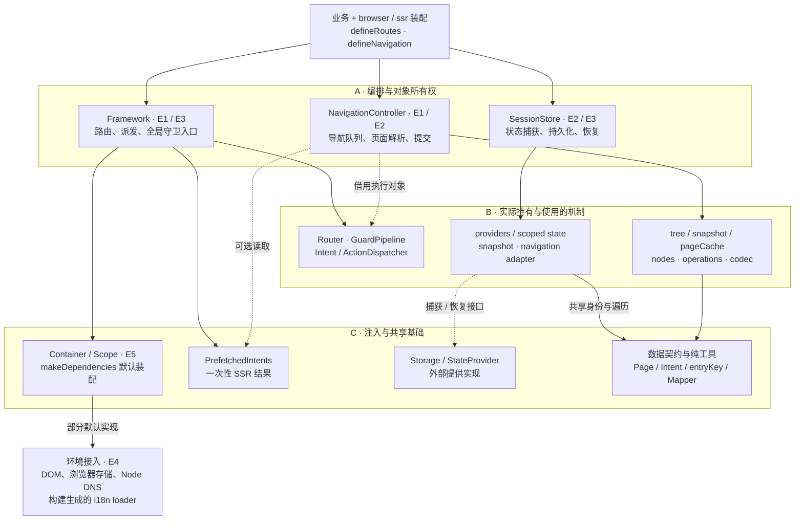
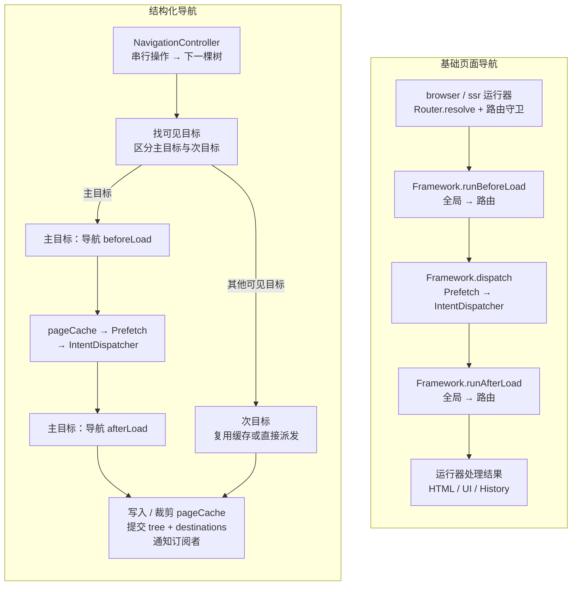
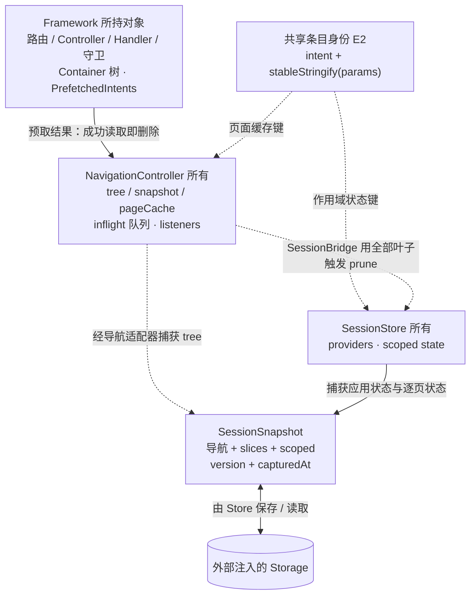
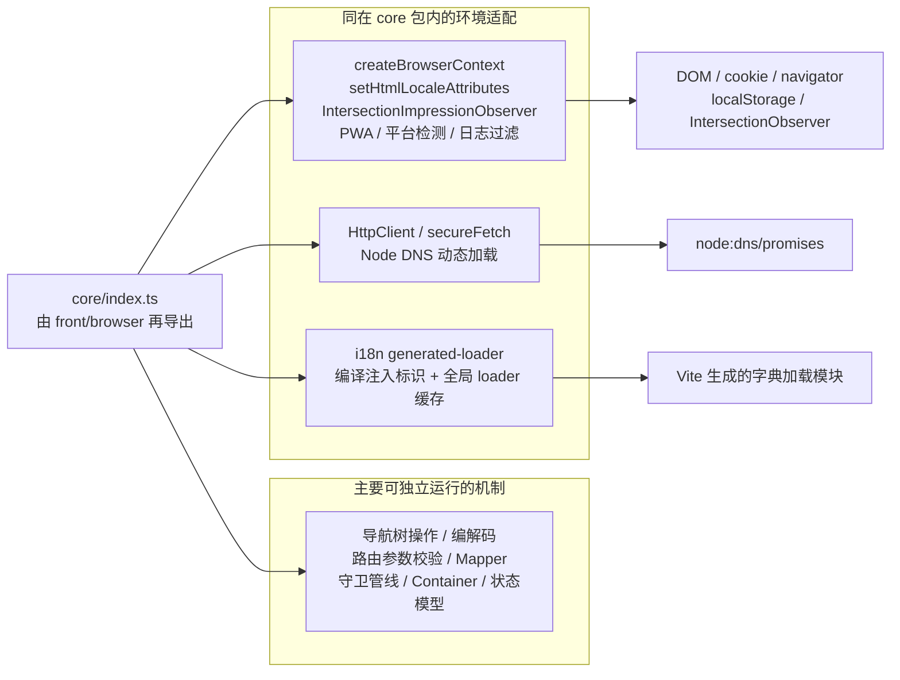

> Historical baseline evaluation, captured before the application-boundaries redesign. Current behavior and measured comparisons are in [architecture.md](./architecture.md).

# core 架构评估视图

基线：`22f2d23`，2026-09-15。范围为 `packages/core/src`，并追踪 `browser` / `ssr` 的实际装配入口。本图描述现有实现；改进建议单独列在第 6 节。

## 1. 先看结论

core 的现状是 **Framework 外观、结构化导航编排器、会话编排器，共用一组机制和接口**。它有可复用的基础模块，但完整页面生命周期分布在多个运行入口，状态清理也由多个所有者共同完成。

评估时优先看三件事：

1. **同一条业务规则经过不同入口是否仍然执行。** 普通 SSR 会运行 Framework 全局守卫和路由守卫；当前结构化 SSR 运行传入的导航守卫，未自动合并前两类守卫。已用同一份 bootstrap 实际复核。
2. **“同一份数据”和“同一个页面实例”是否采用同一种身份。** 页面缓存和会话作用域都用 `intent + stableStringify(params)`，相同参数的两次入栈共享键。已复核两层栈只产生一次加载、一个会话状态槽。
3. **谁负责状态失效和资源清理。** Prefetch、页面缓存、Scope、History、DOM 实例有不同所有者；`Framework.dispose()` 只转交 Container 清理，不能理解为所有运行资源的统一销毁入口。

## 2. 分层主图：模块、调用与横向耦合

**实线**表示现有调用、读写或机制依赖；**虚线**表示由装配者传入的对象、回调或适配接口。此图是运行结构，静态导入统计另见第 7 节。`E1`–`E5` 对应第 6 节的评估项。



### 主图里需要读出的边界

- **Framework 不是唯一执行管线。** 它创建 Router、两种 Dispatcher、Container 和 PrefetchedIntents；基础页面流程由外层运行器组织。NavigationController 直接调用注入的 IntentDispatcher，并自行读取 PrefetchedIntents，没有经过 `Framework.dispatch()`。
- **SessionStore 通过接口调用导航。** Store 不直接持有 NavigationController；但随包提供的导航适配器以及 scoped-state helper 会使用导航序列化、条目键和树遍历，所以 `session` 目录整体与 `navigation` 存在依赖。
- **Container 与默认装配要分开理解。** Container 本身只实现注册、解析和作用域；`makeDependencies()` 选择默认网络、存储、日志、国际化及平台实现。HttpClient 是供业务使用的基类，并非默认自动注册的业务 API 服务。
- **core 无 UI 框架依赖，但含环境适配实现。** 具体调用点见第 5 节；它可以被 SSR 导入，不代表每个导出的函数都适合在所有环境调用。
- “数据契约与纯工具”是职责汇总，现有仓库没有一个统一的“契约层”目录；类型、常量、工厂与默认实现部分同文件分布。

## 3. 执行视图：完整生命周期由谁编排



图示为正常路径；异常、redirect、deny、rewrite 的细节由各运行器处理。**两列相似的步骤不等于相同的执行语义。**

| 比较项          | 基础页面路径                                | 结构化导航路径                                                | 架构含义                                 |
| --------------- | ------------------------------------------- | ------------------------------------------------------------- | ---------------------------------------- |
| 全局与路由守卫  | 调用 Framework 方法，合并两类守卫           | 当前 browser / SSR 装配仅传 navigation.beforeLoad / afterLoad | E1：不能假设守卫自然继承                 |
| 多个可见页面    | 单个 Page                                   | 主目标运行导航守卫；其他可见目标不运行守卫                    | 需要定义“导航检查”和“目标数据检查”的范围 |
| 缓存读取        | 一次性 PrefetchedIntents                    | 长期 pageCache → 一次性 PrefetchedIntents                     | 返回页面与重新加载的策略不同             |
| 并发导航        | 浏览器通过导航序号抑制过时提交              | 以 Promise 队列按提交顺序执行                                 | 用户连续操作时的等待/覆盖策略不同        |
| dispatch 失败后 | 普通 SSR 先生成错误页，仍进入 afterLoad     | 主目标返回 500 结果，跳过 afterLoad                           | 错误页上的守卫行为需要明确契约           |
| 结果提交        | 运行器调用 renderApp / updateApp 并管理 URL | Controller 提交快照，bridge 再管理 URL / DOM                  | 提交成功与界面就绪属于不同边界           |

### 已执行的同配置复核

给同一个 bootstrap 注册全局、路由两类 before/after 守卫和同一个 Controller：

```text
普通 SSR：
global-before → route-before → controller → global-after → route-after

结构化 SSR（另外配置 navigation 守卫）：
navigation-before → controller → navigation-after
```

这是调用实际 `ssrRender()` 与 `ssrRenderNavigation()` 得到的执行记录，不是从名称推断。浏览器结构化路径也只传 navigation 守卫，见 [start-app.ts](/Users/megumi/Desktop/projects/finesoft-front/packages/browser/src/start-app.ts:412)；该浏览器配置的同场景探针未另行运行。flat-islands 的装配甚至没有传 before/after 守卫，见 [flat-islands.ts](/Users/megumi/Desktop/projects/finesoft-front/packages/browser/src/flat-islands.ts:87)。

## 4. 状态视图：所有者、身份和失效边界



注：预取结果也可以被 `Framework.dispatch()` 直接消费，不必进入 NavigationController。图中的 Prefetch → pageCache 表示结构化导航分支。

| 状态或资源                                     | 创建/持有者                                  | 清理或失效                                          | 评估重点                                                   |
| ---------------------------------------------- | -------------------------------------------- | --------------------------------------------------- | ---------------------------------------------------------- |
| 路由、Controller、ActionHandler、全局守卫      | Framework 所持对象/数组                      | 当前 `Framework.dispose()` 未清空这些注册           | Framework 存活期与外部引用需要一致                         |
| DI 注册项、单例引用、子容器                    | Container                                    | dispose 递归清除注册和实例引用                      | 不自动调用被注册服务自身的 dispose                         |
| PrefetchedIntents                              | Framework 持有，运行层注入                   | 成功 get 一次后删除                                 | 不是普通请求结果缓存                                       |
| tree、snapshot、pageCache                      | NavigationController                         | pageCache 按树中全部叶子裁剪；可 invalidate/refresh | 不可见但仍在树中的条目保留                                 |
| 导航订阅者                                     | NavigationController                         | subscribe 返回取消订阅函数                          | Controller 接口没有整体 dispose                            |
| 会话 scope                                     | SessionStore                                 | restore 可替换 scope；prune 由 SessionBridge 触发   | 持有旧 scope 引用可能跨不过 restore；bridge 用 getter 转发 |
| 自动保存定时器、pagehide/visibilitychange 监听 | browser SessionBridge                        | bridge.dispose                                      | 生命周期跨包，core Store 自己不监听导航                    |
| URL/history、滚动、DOM 实例                    | browser History / NavigationBridge / Islands | 由相应运行层对象处理                                | 页面数据缓存、DOM 保活和会话恢复是不同资源                 |

### 重复入栈的身份实验

```text
初始栈：detail(id=7)
再次 push：detail(id=7)

实际结果：栈深度 2；Controller 执行次数 1；会话 scope 键数量 1。
第二次以相同键写入草稿，会覆盖第一次写入的草稿。
```

该行为适合按业务目标复用页面的设计。若产品允许“同一详情打开两个独立编辑实例”，则需要单独评估页面实例身份、缓存身份和恢复身份，不能只靠现有 content key 区分它们。

### dispose 实验

读取一个带 `dispose()` 方法的 DI 服务后调用 `Framework.dispose()`：Container 的注册被清除；该服务的 `dispose()` 未执行；IntentDispatcher 中的 Controller 注册仍存在。这里只证明清理契约范围，不据此推断已发生内存泄漏。

## 5. 环境与扩展边界



这些环境接入多数位于函数调用或动态导入处；不能把它们等同于导入 core 就会失败。它们说明包边界同时承载“共享机制”和“环境工具”，评估后续复用、独立测试、打包边界时需要分别看待。

| 接入点               | 现有扩展方式                                              | 边界                                                       |
| -------------------- | --------------------------------------------------------- | ---------------------------------------------------------- |
| 业务结果             | IntentController / BaseController / defineRoute handler   | execute + fallback，接收整个 Container                     |
| 用户动作             | ActionHandler 注册                                        | 调度器按 kind 执行；UI/导航副作用由外部 handler 实现       |
| 导航策略             | Guard / createContext / onRedirect / getErrorPage         | 所属入口决定实际接入与执行范围                             |
| 默认服务             | FrameworkConfig / Container.register                      | makeDependencies 先选择默认实现，业务可在 bootstrap 中覆盖 |
| 会话与存储           | SessionNavigationAdapter / SessionStateProvider / Storage | Store 不决定 Web Storage 或网络持久化介质                  |
| 视图、URL 和实例挂载 | browser / ssr 的回调与 bridge                             | 不由 core 的 Page 数据模型直接管理                         |

## 6. 架构评估项与建议顺序

下表的“建议”是后续设计选择；本次未修改运行代码。

| 项                              | 现状证据                                                                                                                    | 影响与评估判断                                                                        | 建议顺序                                                                                      |
| ------------------------------- | --------------------------------------------------------------------------------------------------------------------------- | ------------------------------------------------------------------------------------- | --------------------------------------------------------------------------------------------- |
| **E1 执行策略的统一归属**       | 普通与结构化 SSR 的同配置执行轨迹不同；多个位置自行组织加载、缓存和守卫                                                     | 共享 Router/Dispatcher 并未自动保证模式之间的策略一致性。这是当前最优先需要评估的边界 | **先确定契约**：全局/路由/导航守卫分别覆盖谁；再评估提取共享的目标加载与结果处理逻辑          |
| **E2 内容身份与实例身份**       | 相同 intent+params 的重复栈项共用 pageCache / scope 键                                                                      | 是否合理取决于应用是否允许相同业务目标出现多个独立页面实例                            | **先确定产品语义**：需要独立实例时，区分 entry instance key 与 data cache key，并评估恢复兼容 |
| **E3 跨对象的生命周期所有权**   | Framework、NavigationController、SessionStore 与 browser bridges 分别持有资源；dispose 实验仅清 DI 引用                     | 当前可按入口正常组织资源，但接入新运行层时需要知道完整的创建/订阅/清理链              | **明确所有权协议**：谁创建、谁取消订阅、谁处理服务释放、什么是已销毁对象                      |
| **E4 共享机制与环境适配同包**   | DOM helper、localStorage、Node DNS、构建注入 loader 与纯机制统一导出                                                        | 影响环境契约和独立复用的清晰度；目前没有证明导入失败或包体积问题                      | 根据实际消费者评估独立入口或 adapter 模块，不先做大规模搬目录                                 |
| **E5 服务契约与默认实现的位置** | Storage / Net / Metrics 等契约定义在 make-dependencies.ts；Controller 接收完整 Container；Framework.create 自动装配默认服务 | 类型依赖可被擦除，但源码所有权仍集中在装配文件；业务隐含依赖在 resolve 时才显现       | 按独立复用需求拆出稳定接口；为复杂业务约束依赖键/能力集合，避免全量重构                       |

### 已有边界中值得保留的部分

- 静态值导入/再导出图未发现文件循环依赖；不需要因为层次图有横向连线就认定存在循环。
- 导航树操作采用纯函数，Controller 负责异步操作排队、解析和提交，两个职责已有可测试的边界。
- SessionStore 通过导航适配器和 Storage 接口接入外界，providers 的异常隔离与快照版本/过期检查已有测试。
- 导航与会话作用域共享 `entryKey` 和“全部存在叶子”的算法，避免两个模块各自解释条目保留规则；后续若改变身份，需要共同迁移。

## 7. 证据、统计口径与验证范围

### 静态依赖

TypeScript AST 扫描 `packages/core/src`：

| 项目                      | 结果                                                                  |
| ------------------------- | --------------------------------------------------------------------- |
| TypeScript 源文件         | 74                                                                    |
| 文件间静态值导入/再导出边 | 132                                                                   |
| 显式类型导入/再导出边     | 152                                                                   |
| 值依赖文件循环            | 0                                                                     |
| 加入类型边后的循环        | 1 组：i18n/messages.ts ↔ i18n/generated-loader.ts，其中返回边仅为类型 |
| navigation 目录           | 9 文件，2,402 物理行（含注释）                                        |
| core 总计                 | 7,672 物理行（含注释）                                                |

口径：同一文件对和同一种边只计一次，包含 barrel 再导出；不展开动态导入、不代表 tree shaking 后包大小，也不证明运行状态没有反馈环。导航目录的体量用于定位阅读范围，不单凭行数判定质量。

### 运行复核

- **16 个现有测试文件，208 项通过**：Framework、navigation/controller、session、Container、middleware、prefetch，以及 browser FlowAction / SessionBridge、SSR render / navigation。
- **3 项针对性探针通过**：同配置守卫接入差异；重复内容的导航身份；一次性预取与 dispose 边界。
- 未改业务或框架运行代码。验证是 Vitest 单元/适配层测试和本地源码探针，未包含完整浏览器端到端验收、生产运行、性能基准或打包体积测量。

本机复核产物位于忽略目录 `reports/core-architecture/`：

- [依赖图原始数据](/Users/megumi/Desktop/projects/finesoft-front/reports/core-architecture/dependencies.json)
- [静态分析脚本](/Users/megumi/Desktop/projects/finesoft-front/reports/core-architecture/analyze.mjs)
- [运行探针](/Users/megumi/Desktop/projects/finesoft-front/reports/core-architecture/architecture-probe.test.ts)
- [探针执行记录](/Users/megumi/Desktop/projects/finesoft-front/reports/core-architecture/runtime-evidence.json)

复核命令（在仓库根目录运行）：

```sh
vp exec node reports/core-architecture/analyze.mjs
vp test reports/core-architecture/architecture-probe.test.ts
vp test packages/core/test/framework.test.ts packages/core/test/navigation/controller.test.ts packages/core/test/session packages/core/test/dependencies/container.test.ts packages/core/test/middleware packages/core/test/prefetched-intents packages/browser/test/action-handlers/flow-action.test.ts packages/browser/test/session-bridge.test.ts packages/ssr/test/navigation.test.ts packages/ssr/test/render.test.ts
```

### 关键源码定位

| 主题                       | 源码                                                                                                                          |
| -------------------------- | ----------------------------------------------------------------------------------------------------------------------------- |
| Framework 创建、派发与清理 | [framework.ts](/Users/megumi/Desktop/projects/finesoft-front/packages/core/src/framework.ts:40)                               |
| 路由与 Controller 装配     | [define-routes.ts](/Users/megumi/Desktop/projects/finesoft-front/packages/core/src/bootstrap/define-routes.ts:200)            |
| 导航队列、缓存、目标解析   | [navigation/controller.ts](/Users/megumi/Desktop/projects/finesoft-front/packages/core/src/navigation/controller.ts:304)      |
| 浏览器结构化守卫装配       | [browser/start-app.ts](/Users/megumi/Desktop/projects/finesoft-front/packages/browser/src/start-app.ts:412)                   |
| SSR 结构化守卫装配         | [ssr/navigation.ts](/Users/megumi/Desktop/projects/finesoft-front/packages/ssr/src/navigation.ts:347)                         |
| 普通 SSR 生命周期          | [ssr/render.ts](/Users/megumi/Desktop/projects/finesoft-front/packages/ssr/src/render.ts:142)                                 |
| SessionStore 所有权        | [session-store.ts](/Users/megumi/Desktop/projects/finesoft-front/packages/core/src/session/session-store.ts:40)               |
| scope 与导航树的耦合       | [scoped-state.ts](/Users/megumi/Desktop/projects/finesoft-front/packages/core/src/session/scoped-state.ts:16)                 |
| SessionBridge 保存与清理   | [session-bridge.ts](/Users/megumi/Desktop/projects/finesoft-front/packages/browser/src/session-bridge.ts:101)                 |
| Container 的实际清理范围   | [container.ts](/Users/megumi/Desktop/projects/finesoft-front/packages/core/src/dependencies/container.ts:96)                  |
| 默认服务与环境探测         | [make-dependencies.ts](/Users/megumi/Desktop/projects/finesoft-front/packages/core/src/dependencies/make-dependencies.ts:179) |
