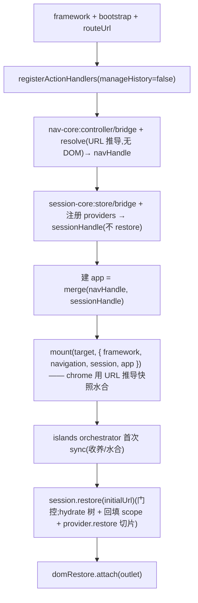

# 治 handle 之舞 —— mount 时交付 handle + 统一 app 句柄

> 状态:已确认方向(2026-06-12)。分支 `feat/session-restoration`。属「配置接入精简」系列第一项(框架无关、不出适配包)。
> 关联:[2026-06-11-ssr-of-islands-design.md](./2026-06-11-ssr-of-islands-design.md)(本设计连带改进其水合 parity 处理)。

## 1. 目标与背景

**问题(handle 之舞)**:`startBrowserApp` 在 **mount 之后**才经 `onNavigationReady` / `onSessionReady` 回调把 `NavigationHandle` / `SessionHandle` 交给应用;而应用组件在 **mount 时**就创建了。应用只能用一套样板桥过这个时间差:

- 可变模块变量 `let navHandle = null; let sessionHandle = null;`
- 预建一个 `makeController()`(闭包读那些变量,Vue 还要 `markRaw`)在 mount 时传给组件;
- 在 `onNavigationReady`/`onSessionReady` 里回填变量。

这套「模块变量 + 预建 controller + 事后回填」就是之舞。三家族模板里只有 `vue-minimal` 用到结构化导航+会话,故只有它写了这套(见 `templates/vue-minimal/src/main.ts` L24-48、88-99)。

**根因**:handle 晚于 mount 到达。**治法**:让 handle 在 mount 时就绪并经 mount context 交付;框架再提供一个合并 nav+session 的统一句柄,免应用手拼 facade。

**成功判据**:
- `vue-minimal` 的 `main.ts` 不再有 `navHandle`/`sessionHandle` 模块变量、`makeController`、`onNavigationReady`/`onSessionReady`。
- 组件拿到一个就绪的统一句柄(命令 + 查询齐全)。
- 既有能力不回归:keep-alive、深链重载恢复、SSR 水合**零失配**。

**非目标**:出每框架适配包(`@finesoft/vue` 等);收编 flat 路径的 `updateApp`(另一热点,本次不动);flat-islands 的 handle 交付(见 §8)。

## 2. 设计决策

- **交付方式**:handle 放进 `mount` 的 context(而非事后回调)。这是唯一能让组件在创建时就拿到 handle 的方式(return 值 / 后置回调都太晚)。
- **统一句柄**:框架构建一个**扁平合并** nav+session 组件面的句柄(下称 `app`),连同 raw `navigation`/`session`(逃生口)一起放进 context。扁平合并因为 nav/session 成员无命名碰撞,且最贴近应用现有的 `makeController` 形状,迁移最省。

## 3. mount context 形状

```ts
mount(target, {
  framework,                      // 现有,不变
  navigation?: NavigationHandle,  // 配了 navigation 时(raw 逃生口)
  session?: SessionHandle,        // 配了 session 时(raw 逃生口)
  app?: AppHandle,                // 统一句柄:配了 navigation 和/或 session 时
}) => updateApp                   // 返回值不变(flat 用它推 page;islands 返 () => undefined)
```

- flat 路径(无 navigation 无 session):context 仅 `{ framework }`,行为字节级不变。
- `app` 的名字暂定 `app`(框架已有 `BaseController`,不用 `controller` 以免重名)—— **见 §10 开放点,可改**。

## 4. 统一 `app` 句柄成员(扁平合并)

`app` = NavigationHandle 与 SessionHandle 的**组件面成员**平铺合并(无碰撞):

| 来源 | 并入 `app` | **不并入**(留 raw handle) |
| --- | --- | --- |
| `NavigationHandle` | `getSnapshot` `subscribe` `push` `pop` `popToRoot` `replaceTop` `selectTab` `selectColumn` | `hydrate`(桥内部 / popstate 用) |
| `SessionHandle` | `save` `clear` `scope` | `restore`(boot 专用,框架调) `dispose`(teardown) |

- 只配 navigation → `app` 仅 nav 面;只配 session → 仅 `{ save, clear, scope }`;两者皆配 → 合并。
- 被排除的成员(`hydrate`/`restore`/`dispose`)经 context 里的 raw `navigation`/`session` 访问。
- `scope` 是 getter(委托当前 store.scope),合并时保持 getter 语义、不快照实例。

## 5. boot 时序重排

把 `activateNavigation` / `activateSession` 各拆成 **core(mount 前)** + **DOM 段(mount 后)**。

### 关键修正:session **restore 留在 mount 后**(否则破坏 SSR 水合 parity)

> brainstorm 时初版把「session boot 恢复」也放 mount 前。精算后修正:**restore 必须留在 mount 后**。
> 原因:`restore` 会(a)`provider.restore` 回填应用切片(如 `state.name`)、(b)`hydrate` 可能换上保存的树。
> 这些值 SSR 端无从知晓(sessionStorage 是客户端的),SSR 只能渲默认值。若 restore 在 mount(= 水合)前跑,
> 客户端 chrome 会带「已恢复值」水合、与 SSR 的默认值**失配**。维持 restore 在水合后 → 水合时两端都是默认值、
> 一致;恢复值作为**水合后的响应式更新**生效(与当前行为一致)。

故拆分为:
- **nav-core(mount 前)**:建 `NavigationController` + `NavigationBridge` → `navHandle`;`await controller.resolve()` 解析 **URL 推导**的首屏(不碰 DOM)。`navHandle.getSnapshot()` 即 URL 推导快照。
- **session-core(mount 前)**:建 `SessionStore` + 注册 providers + `SessionBridge` → `sessionHandle`(`save`/`clear`/`scope` 即可用)。**不调 restore**。
- 建统一 `app` = merge(navHandle, sessionHandle)。
- **mount(target, { framework, navigation, session, app })**:chrome 用 `navHandle.getSnapshot()`(URL 推导快照)+ 默认切片水合 —— 与 SSR 一致(见 §6)。
- **islands(mount 后)**:从 outlet 建 orchestrator + 首次 sync(收养/水合 SSR islands)。
- **session.restore(initialUrl)(mount 后)**:门控通过则应用保存的树(`hydrate` → orchestrator 经订阅重 sync)+ 回填 scoped + `provider.restore`(切片,水合后响应式更新)。
- **domRestore.attach(outlet)(mount 后,在 restore 之后)**:此时 scope 已被 restore 回填,catch-up 才能取到 `__dom`。



## 6. SSR 水合 parity 的连带改进

当前(ssr-of-islands)为绕开「客户端水合时 snapshot=null」而让 SSR 用 `{ snapshot: null, name: "" }` 渲 chrome。
新时序下客户端 mount 时已有 **URL 推导快照**,故:

- **SSR 改为用真实(URL 推导)快照渲 chrome**:`createSSRApp(App, { state: { snapshot, name: "" } })`(`snapshot` 来自 `renderApp` 第三参)。客户端 mount 也用 `navigation.getSnapshot()`(同一份 URL 推导快照)→ **一致**,且 **nav bar 首屏即被 SSR 渲出**(比现在「水合后才出」更好)。
- `name`(会话切片)两端都保持默认 `""` 水合 —— 因 restore 留在 mount 后(§5),恢复值水合后才生效,parity 不破。

即:本设计不仅治之舞,还把 SSR chrome 从「snapshot:null 占位 hack」升级为「渲真实导航骨架」。

## 7. 数据流收益(vue-minimal main.ts)

```ts
// 之后:
startBrowserApp({
  bootstrap,
  mount(target, { app, navigation }) {
    state.snapshot = navigation.getSnapshot();          // 终态(URL 推导)快照,首帧即有
    navigation.subscribe((s) => (state.snapshot = s));  // 应用自己的响应式绑定(本质,保留)
    const chromeRoot = ensureChromeRoot(target);        // shell 处理(另一热点,本次不动)
    const factory = chromeRoot.firstChild ? createSSRApp : createApp;
    factory(App, { state, controller: markRaw(app) }).mount(chromeRoot);
    return () => undefined;
  },
  navigation: { ...navigation.toBrowserConfig(), mountEntry },
  session: { providers: [profileProvider] },
  domRestore: true,
});
```

消失:`navHandle`/`sessionHandle` 模块变量、`makeController`、`onNavigationReady`、`onSessionReady`。
保留(本质):`navigation.subscribe` 绑 snapshot 到自家 reactive、`markRaw`(Vue 不代理句柄)、shell 处理(另一热点)。

## 8. 向后兼容 / 迁移面

- **移除 `onNavigationReady` / `onSessionReady`**(`BrowserAppConfig`)。全仓仅 `vue-minimal` 用 → 只迁它一个;react/svelte 模板未用结构化导航,不受影响。
- **flat 路径(无 navigation)**:`mount(target, { framework })` → `perform` → `updateApp`,字节级不变。
- **flat + session(无模板在用)**:session handle 也进 context;但其 boot-restore 因会 `navigate`(走 `perform`→`updateApp`)仍留 mount 后。本设计不为这条未用路径额外加工。
- **flat-islands**:其 controller 依赖 outlet(mount 后才有),拿不到「mount 时交付」。**本次不纳入**,维持现状(FlowAction 驱动,本就不靠 handle)。
- **`mount` 签名**:`context` 加 `navigation?`/`session?`/`app?` 是纯附加;现有 flat 模板忽略即可,无破坏。

## 9. 测试

- **`packages/browser/test/start-app.test.ts`**:
  - 配了 navigation+session 时,`mount` 的 context 收到 `navigation`/`session`/`app`(均为可用 handle)。
  - `app.push` 委托 `navigation.push`、`app.save` 委托 `session.save`、`app.scope` 委托 `session.scope`(getter)。
  - flat(无 navigation/session)时 context 无 `navigation`/`session`/`app`。
  - 时序:`mount` 收到的 `navigation.getSnapshot()` 是 resolve 后的终态(URL 推导)快照(证明 nav-core 在 mount 前完成);session restore 在 mount 后(可用 spy 断言 restore 调用晚于 mount)。
  - `onNavigationReady`/`onSessionReady` 已移除(相关旧用例改写)。
- **e2e(vue-minimal,playwright)**:迁移后 —— 首屏 outlet 含 SSR island 内容 + chrome nav bar SSR 渲出;水合 **0 mismatch**;keep-alive(tab 往返 note 保留);深链重载恢复(note 回填)。

## 10. 非目标 / 开放点

- **统一句柄命名**:暂定 `app`(避开 `BaseController` 重名)。备选 `controller`(模板现用名,但重名)、`handle`。实现期定稿即可。
- **flat-islands handle 交付**:留作后续(outlet 依赖,需另设机制)。
- **shell 处理 / `updateApp` 收编**:接入精简的其它热点,各自独立,后续按全景图推进。
