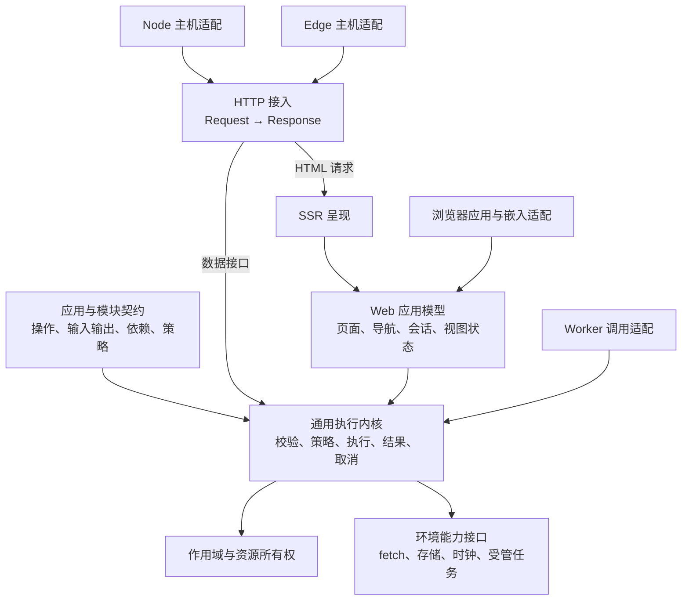

# 框架长期基础设计：执行内核、应用组合与多环境接入

- 日期：2026-09-15
- 状态：设计已于 2026-09-15 经用户确认，包含复杂度约束；进入实施，接口草图仍需由实现与验收落实。
- 已确认：允许调整公开 API，同步迁移仓库内模板和文档，不要求旧接入兼容。
- 共同目标：复杂业务应用、同页多实例与嵌入、多运行环境、独立数据接口。四项全部进入本次设计与验收。
- 现状证据：[Core 架构评估](/Users/megumi/Desktop/projects/finesoft-front/docs/core-architecture-review.md)。

## 1. 完成标准

本次建立可持续演进的运行契约：同一份业务能力能够被页面、HTTP 数据接口和 Worker 调用；应用能够组合模块、隔离实例、释放资源，并能验证每个环境的实际产物。

必须证明以下四类场景同时成立：

| 方向         | 必须跑通的场景                                                                                             |
| ------------ | ---------------------------------------------------------------------------------------------------------- |
| 复杂业务     | 多业务模块组合；Tabs / Stack / Split；同一详情的两个独立编辑实例；更新、返回和重载恢复                     |
| 多实例与嵌入 | 同一文档挂载两个应用；状态、存储键、DOM、订阅互不覆盖；卸载一个不影响另一个                                |
| 多运行环境   | Node HTTP、真实 Worker 执行环境、浏览器主线程和无 DOM 的浏览器 Worker；缺少环境能力时有明确结果            |
| 独立数据接口 | 不配置 Page、Router、Navigation、Renderer 或 DOM，完成带输入校验、业务策略、错误响应和取消传递的 JSON 接口 |

未来新增业务模块、存储实现、UI 渲染器、HTTP 绑定或平台包装，应只增加对应扩展实现及契约测试。若必须再复制执行流程、修改内核的平台条件分支，就说明边界没有建立好。

四类能力之外，接入成本也是完成标准：普通页面和数据接口不能要求使用者手动管理执行作用域、导航身份或内部装配计划。新增能力按场景启用，简单应用使用同一个内核的标准接入。

## 2. 本轮确认的现状

| 观察                           | 证据与边界                                                                                                 | 基础设计要求                                           |
| ------------------------------ | ---------------------------------------------------------------------------------------------------------- | ------------------------------------------------------ |
| 已有通用业务执行原语           | `IntentDispatcher` 的泛型结果可以返回普通数据；实际探针返回 `{ value: 42 }`，不需要页面或导航              | 复用现有分发与 Controller 能力，补足独立执行的公开契约 |
| 页面加载规则分散               | 之前的实际 SSR 探针确认普通与结构化守卫顺序/范围不同                                                       | 通用业务执行与页面加载各有单一所有者                   |
| 请求上下文未贯穿执行链         | Controller 收到 Container；导航输入上的 `signal` 注释明确尚无消费方；HttpClient 便捷请求未提供 signal 选项 | 建立统一 ExecutionContext 与真正的取消传递             |
| 层级容器不等于新的生命周期模型 | 子容器解析父级 singleton 得到同一实例，探针已确认；当前 SSR 每请求新建 Framework，因此不能据此声称请求泄漏 | 显式定义提供者生命周期、解析位置和资源所有权           |
| 内容键同时承担多种身份         | 现有 PageCache、Island 与 session scope 共用 intent+params；重复目标共享状态已实测                         | 分离数据身份、页面实例身份和持久化身份                 |
| 存储边界同步化                 | Storage 与 SessionStore 的持久化接口按同步字符串 KV 设计                                                   | 快照捕获和异步持久化分开，支持本地存储及远端/平台存储  |
| 两端协议各自演进               | SSR 预取是数组；导航与 session 有不同的格式及版本处理；未标注 Page 默认全字段序列化                        | 协议版本、明确输出投影、兼容和恢复策略必须统一归属     |
| 环境条件散落                   | core 包含 DOM、浏览器全局读取、Node DNS 动态导入；server 启动器直接读取 process、文件系统并启动 Vite       | 按能力注入；运行时、开发工具和平台启动分离             |
| 部署生成器复制运行逻辑         | `generateSSREntry` 内联另一套注入、渲染模式、缓存和内部 fetch 流程                                         | 生成代码只包装入口，运行逻辑从统一模块导入             |
| 生成产物缺少执行级验证         | 本地直接生成的标准入口未通过 `node --check`；原始文件第 28 行的字符串含未经转义的换行                      | 把生成、解析、加载和真实请求都纳入平台验收             |

源码定位：

- [Intent 分发](/Users/megumi/Desktop/projects/finesoft-front/packages/core/src/intents/dispatcher.ts)、[Controller](/Users/megumi/Desktop/projects/finesoft-front/packages/core/src/intents/base-controller.ts)
- [容器](/Users/megumi/Desktop/projects/finesoft-front/packages/core/src/dependencies/container.ts)、[导航上下文与取消占位](/Users/megumi/Desktop/projects/finesoft-front/packages/core/src/navigation/controller.ts:160)
- [会话契约](/Users/megumi/Desktop/projects/finesoft-front/packages/core/src/session/types.ts)、[公开数据序列化](/Users/megumi/Desktop/projects/finesoft-front/packages/ssr/src/server-data.ts)
- [服务器装配](/Users/megumi/Desktop/projects/finesoft-front/packages/server/src/create-server.ts)、[部署代码生成](/Users/megumi/Desktop/projects/finesoft-front/packages/server/src/adapters/shared.ts:45)

生成器问题已经定位到外层模板字符串把 `\n` 展开为输出代码里的实际换行。本轮未修运行代码，未检查线上已部署文件。由于原始模块不能解析，原先准备的生成入口 status/redirect 请求探针没有执行成功，不能把源码上发现的转发缺项说成已经实测的响应结果。

## 3. 核心边界



图示表达运行依赖。UI 渲染器由 browser/SSR 在外层接入；HTTP 和 Worker 可以直接调用执行内核。

### 必须长期保持的约束

1. **执行内核独立于页面。** 不依赖 BasePage、DOM、History、Hono、Node 内置模块、Vite 或某个 UI 框架。
2. **应用声明与运行状态分开。** 声明和索引可复用；请求身份、用户状态、进行中的 Promise 和服务实例属于运行作用域。
3. **共享契约与环境实现分开。** 浏览器可以共享操作类型，不能因此导入服务端实现、密钥读取或 Node 驱动。
4. **一种行为只有一个执行所有者。** 页面加载、业务执行、URL 提交、状态恢复分别有明确入口，平台包装不复制这些逻辑。
5. **每项资源都有作用域和释放责任。** 取消、卸载、请求结束与响应流结束都能明确追踪。
6. **出进程数据有明确格式。** 类型参数不能替代运行期校验，内部结果不能自动成为公开 JSON 或 hydration 数据。
7. **能力声明必须对应真实测试。** 用真实环境和构建后产物证明支持范围。

## 4. 业务模型、模块组合与类型

### 4.1 三类业务概念

| 概念             | 表达什么                                         | 可被谁使用                                  |
| ---------------- | ------------------------------------------------ | ------------------------------------------- |
| Operation        | 一次有类型输入输出的业务操作，区分查询和写入     | 页面加载器、HTTP 绑定、Worker、其他业务操作 |
| Page             | 把业务结果组织为可呈现的数据与页面元信息         | Web 应用与 SSR                              |
| Route / Endpoint | 外部地址、方法和参数如何映射到 Page 或 Operation | 对应的 Web / HTTP 接入                      |

保持 Intent/Controller 已有的通用分发能力。Controller 可以适配为 Operation 实现，函数 handler 和类实现不建立两套执行规则。PageLoader 负责组装页面，不要求每个业务操作返回 BasePage。

查询的重复调用可以按明确策略合并；写入默认不缓存、不自动重试。写入需要重试时，由业务提供幂等规则；traceId 不能被当作业务幂等键。取消写入不意味着撤回已经发生的数据变更。

### 4.2 声明、校验、绑定、执行

```text
应用/模块声明
  → 校验与规范化 AppPlan
  → 绑定实现、服务和平台能力
  → 创建 Runtime
  → 每次调用建立 ExecutionScope
  → 执行并返回结果
```

这里的“校验与规范化”可由普通 TypeScript 运行，核心不要求先安装 Vite。构建工具可以提前生成索引和分包清单，运行时仍使用同一份契约。

AppPlan 是框架从声明派生的内部结构，应用无需编写、保存或手动维护它。本次不增加独立配置语言、编译器或元数据注册系统；声明与绑定校验在相应装配边界执行，不在每次请求中重新构建整份应用计划。

声明校验包括：重复操作/路由/服务键、未知引用、模块依赖环、声明的服务依赖环、端点输入映射不完整、缺失页面类型。绑定阶段检查实际实现、生命周期和平台能力是否满足。动态业务输入在每次执行时另行校验。

### 4.3 模块组合

简单应用可以直接声明操作和页面，由框架按同一套规则规范化。需要跨业务组合时，再提取具名模块；模块声明稳定 ID 及实际使用的依赖、操作契约、提供者和策略。Web 路由、页面与视图是模块的可选扩展。依赖顺序确定，重复键默认报错，覆盖必须在应用组合处显式声明。

模块按业务就近组织，只在跨环境共享或依赖隔离需要时拆分契约、服务端实现、浏览器实现和视图文件，不要求每个小功能建立四套目录。仅服务端使用的操作可以就近声明契约和实现；浏览器共享的契约必须保持独立可导入。某个业务模块可以同时提供页面与数据接口；纯数据模块不引入 UI 依赖。实现不靠修改全局注册表进行隐式安装。

优先实现静态模块组合。按需导入使用明确的 loader 和资源释放契约；不在本次建立运行时插件市场或任意模块热替换系统。

### 4.4 类型必须贯穿调用

操作引用关联输入和输出类型，导航引用关联合法页面参数，服务 token 关联值类型，页面类型关联视图 props。调用方不再靠自由字符串与 `resolve<T>("key")` 的类型断言拼接契约。

HTTP/Worker/会话读取仍需要运行期 codec。共享协议只包含允许传输的值；Date、BigInt、类实例等必须经声明的编码器转换。内部操作的返回值可以更丰富，外部编码由绑定决定。

## 5. 独立执行、上下文与策略

ExecutionContext 至少包含调用 ID、trace 关联、取消信号、执行作用域、服务解析和结构化记录接口。请求头、Cookie、平台 bindings 等通过接入层定义的上下文扩展提供。

不再使用 `isServer` 一个布尔值代表环境：浏览器主线程、浏览器 Worker、Node 请求和 Edge 请求的可用能力不同，是否存在 window 不能决定执行语义。

```text
解码输入 → 执行策略 → 查询缓存/调用实现 → 校验结果
         → 记录结果及失效信息 → 由接入层编码
```

- Operation 级策略覆盖 HTTP、Worker、SSR 和页面触发的直接调用。页面导航守卫控制用户流程，不能成为独立数据接口唯一的权限检查。
- 缓存读取发生在相应访问策略之后；公开响应还要经过自己的输出投影。
- 业务拒绝、校验失败、未找到、执行故障和取消具有明确结果类别。HTTP 把它们映射为状态码与 JSON，Web 把它们映射为页面/区域结果。内部异常原因与公开错误信息分开。
- 同一次执行继承 trace 与上下文，子调用不得以另建空上下文的方式绕过策略。
- 观察回调只观察，不能修改执行结果；改变业务流程必须通过声明的策略接口。

## 6. 作用域、资源与多实例

### 6.1 生命周期模型

| 层级                    | 典型所有物                                          | 结束边界                                                 |
| ----------------------- | --------------------------------------------------- | -------------------------------------------------------- |
| AppDefinition / AppPlan | 声明、已验证索引                                    | 无运行资源，不承担请求清理                               |
| RuntimeScope            | 某个应用运行实例的服务、注册和共享资源              | 显式 dispose；服务端可由主机保留一个无请求状态的运行实例 |
| ExecutionScope          | HTTP 请求、任务或导航事务的身份、临时状态、执行资源 | 调用完成/取消；流式响应按实际消费结束释放                |
| EntryScope（Web 可选）  | 某个页面实例的局部状态、订阅、草稿                  | 实例离开保留集合或应用销毁                               |

提供者明确声明 runtime、scope 或 transient 生命周期。scope 服务在发起解析的适用作用域实例化，不能因为注册信息存放在父级就意外成为父级单例。工厂接收明确的 resolver/context，依赖不能通过捕获错误的外层 Container 偷渡。

异步提供者按同一作用域合并并发初始化；失败的初始化不永久污染实例缓存。释放按依赖相反顺序执行、等待受管异步清理、保持幂等。已关闭的作用域不能重新接受执行或注册。

外部传入的连接、SDK 等只有在显式转交所有权时才自动释放。清空 Map 不代表相关监听、连接和任务已经结束。

### 6.2 同页多应用

每个应用运行实例拥有独立的 Runtime、目标 DOM、监听、导航、视图根和状态空间。标准接入接受显式 `target`，不依赖全局固定 ID 或全 document 查询。

浏览器地址栏只有一个，History 接入必须有清楚的主控归属：主应用使用浏览器 History，嵌入应用使用内存 History 或宿主提供的桥。第二个实例不能静默接管已有的地址栏所有者。

`applicationId` 标识应用，`runtimeId` 标识当前运行实例。持久化使用显式、稳定的 `persistenceKey` 区分同页实例；不能直接使用每次启动都会变化的 runtimeId，否则刷新后无法找到旧状态。

卸载流程停止新执行、使过时提交失效、取消订阅与定时器、卸载视图、结束 entry scopes，再释放该实例拥有的服务。一个实例结束不能清除另一个实例的全局记录器或存储空间。

## 7. 导航事务、页面身份与缓存

### 7.1 身份必须本次分离

| 身份                  | 用途                         | 示例                                         |
| --------------------- | ---------------------------- | -------------------------------------------- |
| OperationId / RouteId | 确定业务实现及路由策略       | 两个地址可调用同一操作，但保留各自路由元数据 |
| ResourceKey           | 复用业务查询结果             | 商品 7 的数据，含必要的 locale/身份分区      |
| EntryId               | 一个具体页面实例             | 同一商品的编辑窗口 A 与 B 拥有不同草稿       |
| TransitionId          | 一次导航执行与提交           | 连续打开 A、B，迟到的 A 不能覆盖 B           |
| PersistenceKey        | 重载后定位某个应用实例的状态 | 主应用与嵌入应用各自恢复                     |

新 push 默认建立独立 EntryId；需要回到已有实例时使用明确的复用操作。缓存可以共享同一 ResourceKey 的数据，EntryScope 与 DOM 根仍保持独立。SSR 生成的 EntryId 随 hydration 协议交给浏览器，不在客户端重新随机生成。

### 7.2 提交与取消

导航状态机至少区分：候选导航、加载中、守卫通过、状态已提交、视图就绪，以及拒绝/失败/取消。取消信号贯穿 PageLoader、Operation、HTTP 客户端和可取消的外部请求。

- URL 导航允许新操作使旧结果失效；树编辑保持有序语义。两者共享执行和提交契约，不各自复制加载流程。
- 只有当前有效事务能够提交状态、写入当前页面结果和触发页面访问事件；被取消的结果不进入页面缓存。
- 状态提交与 DOM 就绪分别记录。逻辑提交原子化不意味着能回滚任意 UI 副作用或已经发生的外部写入。
- History 与滚动恢复遵守既有回归要求：目标数据、后置策略和视图提交完成后再恢复滚动，持续检查事务 ID 与 history entry ID。
- beforeNavigate / beforeCommit 是导航事务策略；beforeLoad / afterLoad 是每个可见页面的加载策略；Operation 自身策略对其所有调用者生效。
- Split 的多个可见目标确定性归并。单区域错误与整次导航重定向有明确区别；HTTP 状态由主目标与响应策略决定。

### 7.3 缓存与失效

ResourceCache、一次性 SSR Prefetch、页面实例保留和 SessionSnapshot 分别管理。ResourceCache 声明作用域、有效期、分区和失效依赖；默认不建立跨用户、跨运行实例的共享缓存。

业务写入成功后显式产生受影响资源的失效信息，当前应用据此刷新列表/详情。跨进程缓存一致性由所选存储及消息能力决定，内核不假装拥有分布式事务。

身份/租户或语言上下文变更时更新缓存分区，旧分区结果不能直接进入新上下文。EntryId 不承担数据缓存分区职责。

### 7.4 渲染适配协议

视图适配器需要支持 mount/hydrate、update、DOM 就绪和 dispose。保持同一 EntryId 和视图类型时，更新 Page 应走 update；换视图类型或显式 reset 才重新挂载。刷新数据不默认销毁草稿和组件局部状态。

root 与 entries 两种呈现策略继续支持，底层都消费同一份提交状态。entries 可按 visible/present 选择卸载或脱离 DOM 后保留；保留不等于暂停其所有任务，活动状态与后台资源策略需要有明确通知。

## 8. HTTP、Worker 与平台能力

### 8.1 HTTP 是独立接入

统一的 HTTP 处理边界是标准 `Request → Promise<Response>`。Node 监听端口、Edge fetch 入口、Hono 路由组合都是外层接入方式，不是内核初始化的前置条件。

端点显式声明方法、路径、输入解码、操作引用、输出投影及错误映射。已有内部 Controller 不会因为注册就自动暴露为远程接口。独立 JSON 接口不要求输出 Page 字段或框架 hydration 包装。

HTTP 接入明确处理 Request、signal、status、headers、Cookie、redirect 和流式 body。HTML/JSON 的编码与缓存策略由对应响应策略负责，不能在生成入口里重新解释一遍。

### 8.2 按能力绑定平台

平台声明并提供 fetch、clock、存储、随机 ID、受管后台任务等能力；DNS 或文件系统只由需要它们的具体服务声明。能力要求可在装配时检查，调用时仍要处理真实 I/O 失败。

Node 的 process/env、文件读取和监听只存在于 Node 接入。Edge bindings 和请求执行上下文由该次调用传入，不能复制到模块级的“当前 env/用户”变量。浏览器 Worker 可以直接执行数据任务，完全不创建 DOM、History 或 Page。

网络策略需要的 DNS 等能力缺失时，必须报告能力不满足，或选择显式声明的替代策略；不能把跳过检查表示为检查成功。模块声明和构建边界共同防止 Node 实现进入浏览器/Worker 入口。

### 8.3 取消、响应流与受管后台任务

取消默认是合作式：内核传递 signal、停止后续调度并拒绝过时提交，具体 I/O 和业务实现负责响应。定义 signal 存在但不消费，不算支持取消。

返回一个流式 Response 不代表请求资源已可释放。HTTP 适配器把 scope 结束绑定到响应流结束/取消，并处理读取失败；测试要在 Response 返回后继续消费流，验证资源仍有效。

后台任务通过主机提供的受管接口登记。主机不支持该能力时给出明确结果，不靠未等待 Promise 假定进程/Worker 会继续存活。需要可靠跨重启投递的任务属于外部任务系统，本次不实现队列产品。

## 9. 序列化、持久化与版本

### 9.1 三种版本分别管理

| 版本                            | 解决的问题                                   |
| ------------------------------- | -------------------------------------------- |
| package/API version             | 开发者代码的导入与调用兼容                   |
| wire protocol version + buildId | SSR 数据、导航标识与客户端资源是否能共同解释 |
| state schema version            | 某个模块或应用的持久化状态是否可以恢复/迁移  |

普通业务 JSON 由端点自身的公开契约决定，不强迫所有外部客户端理解框架内部协议。hydration、Worker 消息与会话数据则使用明确的封装和解码校验。

服务端只输出声明允许公开的数据。Page 字段白名单继续保留，但新版不能默认把未声明的整个内部对象塞入 HTML。深层对象通过明确投影或 codec 控制，字段名白名单不替代嵌套结构验证。

协议不匹配时给出可解释的诊断与回退，不强行水合；持久化状态可以按模块迁移或丢弃不兼容部分，避免一个模块升级就无条件丢弃所有应用草稿。buildId 变化本身也不等于所有状态都要失效。

### 9.2 异步存储

快照 capture 是从内存取得一致状态；persist/load 是可等待的异步操作。存储接口区分读取失败、写入失败、缺失和已保存，不把 no-op 当成持久化成功。

同步 Web Storage 可以包装为该接口；远端/平台存储无需伪装成同步。浏览器恢复顺序仍保证先按 SSR 状态完成水合，再应用用户会话。持久化应在状态变更时持续进行，不能承诺卸载事件能完成任意异步存储写入。

## 10. 扩展、观测与架构约束

### 10.1 有边界的扩展

提供者、执行策略、HTTP 绑定、视图渲染器、存储和平台适配器各有独立协议。扩展按实际需要声明依赖、能力、顺序和资源释放；无状态函数不必实现空生命周期钩子。普通插件不获得修改全部内核私有对象的万能入口。

标准 UI 适配器使用和第三方渲染器相同的协议。核心测试使用与正式适配器相同的驱动接口，避免只有自家隐藏接线才能跑通。

### 10.2 可解释的执行

复用现有 Logger/EventRecorder，稳定记录 applicationId、runtimeId、executionId、transitionId、operationId、阶段、耗时、缓存决策和错误代码。请求体、Cookie、凭据及整个 Page 不进入默认诊断事件。

诊断应能回答：为什么执行/跳过这个 Controller、哪个策略拒绝了操作、为何命中缓存、哪个事务被取消、哪个实例仍保留、哪个 scope 尚未释放。已有日志基础不需要另造一套监控服务。

### 10.3 架构规则进入自动检查

- 内核对 Web/DOM、Node、Hono、Vite、UI 框架的禁止依赖。
- 浏览器和 Worker 的真实入口导入图及打包产物检查，包含动态依赖。
- 服务端实现不能进入浏览器契约入口。
- 公共 exports 和声明文件测试，私有 workspace 不从发布产物泄漏。
- 新模块/适配器用相同的符合性测试集验证，而非只在类型上实现接口。
- 后续公共 API、wire 格式和状态格式变更必须附迁移规则及相应版本处理。

## 11. 代码组织和外部使用

### 11.1 建议的内部所有权

| 逻辑模块及候选 workspace | 核心职责                                                         |
| ------------------------ | ---------------------------------------------------------------- |
| core                     | 应用/模块契约、通用操作执行、类型化依赖、scope、资源与通用观测   |
| web（新增边界）          | Page、页面路由、导航树、EntryScope、会话、共享渲染契约           |
| browser                  | DOM、History、嵌入实例、浏览器恢复和页面运行装配                 |
| ssr                      | Web 应用的服务端呈现、公开数据与 hydration 注入                  |
| server                   | 通用 HTTP 接入及按子入口分隔的 Node/Worker 主机适配；可复用 Hono |
| renderers（新增边界）    | React/Vue/Svelte 的客户端和服务端适配                            |
| tooling（新增边界）      | Vite、构建清单、预渲染、部署包装生成和构建期 Node I/O            |
| front                    | 显式公开入口与发布聚合，不承载运行行为                           |

表格规定职责和依赖方向，不把新增三个 workspace 作为完成指标。先用明确模块和入口建立边界；只有依赖隔离、独立构建或测试需要时才拆成 workspace，并验证它带来的收益。仍只发布一个框架运行库 `@finesoft/front`；create-app 继续作为脚手架发布单元。

### 11.2 建议的公开入口

| 场景                  | 入口                                                             |
| --------------------- | ---------------------------------------------------------------- |
| 通用业务契约与执行    | `@finesoft/front`                                                |
| Web 应用定义          | `@finesoft/front/web`                                            |
| 浏览器应用及嵌入启动  | `@finesoft/front/browser`                                        |
| SSR 呈现              | `@finesoft/front/ssr`                                            |
| Request/Response 接入 | `@finesoft/front/http`                                           |
| 主机启动与调用包装    | `@finesoft/front/node`、`@finesoft/front/worker`                 |
| 构建接入              | `@finesoft/front/vite`                                           |
| UI 定义与适配         | `/react`、`/react/browser`、`/react/server`；Vue/Svelte 同样分隔 |

这些是按环境与使用任务划分的候选入口，不将内部每一层都转成公开 API。子入口必须有独立消费者或隔离依赖的理由；合并入口不能破坏浏览器/Worker 的依赖安全。文档每个场景只给一条推荐接入路径，脚手架使用同一条路径。

### 11.3 同一业务的多种使用

下面是高级装配接口草图，用来明确边界，尚不能运行于当前版本。它不作为普通项目的最小接入示例。

```ts
// 共享契约不导入任何服务器实现
const app = defineApp({ id: "shop", modules: [catalogContracts] });

// 服务器/Worker 入口绑定当前环境的实现与提供者
const runtime = createRuntime({
    app,
    implementations: catalogImplementations,
    providers: platformProviders,
});

// 纯数据调用，不需要 Page 或 Router
const result = await runtime.execute(catalog.getProduct, { id: 7 }, invocation);

// 显式 HTTP 绑定；输出标准 Response
const handleRequest = createHttpHandler({ runtime, endpoints });
```

```ts
// 浏览器另行绑定可本地执行的实现或经批准端点访问的远程执行器
const browserRuntime = createRuntime(browserBindings);
const browserApp = await startBrowserApp({
    runtime: browserRuntime,
    web: webDefinition,
    renderer,
    target,
    history: "memory", // 嵌入实例；主应用选 browser 或提供宿主桥
    persistenceKey: "embedded-catalog",
});
```

RuntimeHandle 只承诺执行、执行观察和生命周期；BrowserAppHandle 承诺导航、视图状态与可选 session。类型与实际成员一一对应，不为纯数据调用制造空导航，也不以可选方法堆出一个万能句柄。

简单应用使用框架提供的标准启动函数，自动完成声明规范化、实现绑定、Runtime 和调用作用域的创建；业务仍需明确声明公开端点与可公开数据。复杂应用可以逐项替换同一组绑定，便利入口和高级入口调用同一个执行实现。

脚手架只生成业务定义和必要的环境配置，不向每个项目复制一套容器、导航、hydration 或清理接线。full/minimal 模板使用相同的接入方式，差别来自示例能力与配置。

### 11.4 复杂度约束

内部实现和一次性迁移成本会增加；是否减少后续维护成本，需要在真实迁移中验证。四个方向都支持，也不意味着每个应用默认装载所有能力。

| 容易增加负担的地方 | 约束                                                                                                                                |
| ------------------ | ----------------------------------------------------------------------------------------------------------------------------------- |
| 接入概念过多       | 普通页面只需页面、视图和路由；可复用业务按需提取 Operation。普通数据接口只需操作、端点和必要的平台配置，不手动建立 AppPlan 或 Scope |
| 手工管理多种 ID    | runtimeId、executionId、EntryId、TransitionId 由框架维护。启用持久化、多实例或自定义缓存时，才配置相应稳定身份和策略                |
| 每个功能重复注册   | 从有类型引用派生关联信息，避免契约、实现、路由、视图在多份字符串表中重复登记；需要跨环境隔离的绑定保留显式关系                      |
| 强制模块化和 DI    | 单个操作可用普通函数和显式依赖；有复用、替换或生命周期需求时才使用模块与 provider。受管资源仍须有清楚的所有权                       |
| 万能扩展与组合失控 | 使用各场景所需的窄接口；默认接入固定且可诊断，替换点按需开放。框架明确支持的组合并运行对应契约测试，不承诺任意组合自动成立          |
| 所有能力默认运行   | 独立数据服务不初始化 Web；简单页面不自动开启会话持久化、资源缓存或复杂导航。所用能力依然经过统一的执行和释放流程                    |
| 新增包和运行开销   | 拆包须证明隔离价值；记录模块构建关系、启动工作量和运行资源。性能结论以迁移前后的可比场景测量为准                                    |

先比较六个模板中新增一页、增加一个数据接口、挂载第二个实例和切换平台接入这四项实际工作。记录使用者需要理解的概念、手写文件与配置、重复定义及清理代码；区分新增能力所需声明和框架额外装配。相同能力下，业务侧装配和重复定义应减少，不能仅靠脚手架隐藏它们。

同时比较相同功能、相同构建条件下的产物大小、冷启动、请求耗时和多实例资源释放。新增边界不自动等于性能改善；明显增加的成本必须定位、解释并据此调整实现。

## 12. 实施顺序与共同验收

实施按依赖排序，四个方向的完成条件都保留，不选择单一方向交付。

1. **固定契约和反例。** 覆盖无页面数据执行、同目标双实例、两个应用共存、请求取消、独立 Request/Response、生成产物解析；保存当前行为与新预期的差别。
2. **建立通用执行与作用域。** 定义/实现绑定、模块校验、typed token、生命周期、取消、结果与观测；复用现有 Controller 分发基础。
3. **完成 HTTP 与多环境切片。** 同一数据模块在 Node、真实 Worker 环境运行；HTTP 输入输出、错误、headers、取消和流消费共用契约测试。
4. **分离 Web 并迁移导航。** 建立 EntryId/ResourceKey、PageLoader、事务提交、共享加载规则、异步持久化与版本解码。
5. **实现渲染适配和多实例。** React/Vue/Svelte 共用视图协议；验证更新保留、hydration、同页隔离、卸载和重载恢复。
6. **统一构建与发布入口。** 部署生成器只生成薄包装，删掉内联复制的运行代码；隔离 Node/Vite 依赖并检查实际产物。
7. **完成所有消费者迁移。** 六个 full/minimal 模板、adversarial fixture、脚手架产物、中英文文档、站点例子、AGENTS 和发布脚本一起迁移，删除旧接入。

### 验收用例

| 场景             | 需要的证据                                                                                                              |
| ---------------- | ----------------------------------------------------------------------------------------------------------------------- |
| 数据模块复用     | 同一契约与业务实现经直接执行、HTTP JSON 和 Worker 调用得到相同业务结果及错误分类                                        |
| 多平台真实运行   | 在普通 Node 和真实 Worker 运行时加载打包产物并执行请求；在浏览器真实 Worker 中执行无 DOM 任务；不能只改全局变量模拟     |
| 运行能力边界     | 缺失存储/网络策略所需能力有明确错误；浏览器/Worker 产物不包含不可用的 Node 运行依赖                                     |
| 请求与流生命周期 | 两个并发请求状态不串；请求取消传到 fetch；Response 返回后流仍可读取，结束/取消时资源释放                                |
| 模块装配         | 重复键、未知实现、循环依赖、非法 provider 生命周期和类型错误有明确诊断                                                  |
| 写入与缓存       | 取消不被当成写入回滚；写入不隐式重试；更新后受影响查询失效；身份/语言分区不会互用结果                                   |
| 页面实例         | 同目标同参数打开两次可独立编辑；可共享查询数据；返回、数据刷新和重载不会混淆实例                                        |
| 嵌入隔离         | 同页两个不同 persistenceKey 的应用独立保存/恢复；只有明确的主应用拥有地址栏；卸载重挂无重复监听                         |
| 导航与呈现       | Tabs/嵌套 Stack/Split、SSR/CSR/prerender、root/entries 的关键组合跑通；滚动恢复继续满足现有回归约束                     |
| 协议与公开数据   | 错版本、旧状态、畸形 payload、未知页面类型有明确处理；内部字段不会因默认序列化进入公开响应                              |
| 部署生成         | 包装代码解析、模块加载、Request/header/status/redirect/stream 传递和平台上下文均实测；源码测试通过不替代产物测试        |
| 发布消费者       | 本地打包安装后的纯数据、Node、Worker、浏览器及三个 UI 适配模板运行通过；检查实际 exports 和 optional peers              |
| 普通接入成本     | 单页与数据接口无需手工创建 Scope、维护内部 ID 或重复运行装配；四项实际工作有迁移前后对照，full/minimal 共用标准启动路径 |
| 运行成本         | 相同功能的产物、冷启动和请求开销有迁移前后记录；未启用能力不创建对应运行资源，多实例释放有实际验证                      |

每个阶段带相应测试与可运行切片，避免等到最后才集成。执行必要的 `vp check`、测试、包/模板构建与浏览器/Worker 验证；验收矩阵未完成就不能称基础改造完成。

已具备的 SSR/CSR/prerender、导航组合、SSR 数据公开控制和现有网络保护必须迁移保留。新的流式 SSR 调度器、分布式缓存系统、持久任务队列和插件市场不是本次产品交付；本次建立并实测与这些能力相关的基础响应、存储、生命周期和扩展边界。

## 13. 本轮改动与验证边界

本轮重写设计，新增本地诊断探针；没有修改框架运行源码、提交、发布或部署。

后续设计复核补充了复杂度约束，调整模块、workspace、公开入口和标准接入的要求。这些属于设计文档修订，尚无新版运行实现或性能对照结果；以下测试记录来自前述现状诊断。

已执行 `vp install`。现有五个相关测试文件的 38 项测试通过；诊断文件的三项现状断言通过。诊断对生成代码的语法错误采用“预期观察到错误”的断言，不能把它解读为生成器已经修复。

独立语法检查：

```sh
vp exec node --check reports/core-architecture/generated-entry-probe.mjs
```

结果是 `SyntaxError: Invalid or unexpected token`，定位原始生成文件第 28 行。这是新发现的实际产物问题，列入后续生成器迁移与回归范围。status/redirect 的生成路径运行复核因解析失败没有完成；当前没有真实 Edge/Worker 平台验收结果。

本地证据：

- [诊断探针](/Users/megumi/Desktop/projects/finesoft-front/reports/core-architecture/foundation-probe.test.ts)
- [运行记录](/Users/megumi/Desktop/projects/finesoft-front/reports/core-architecture/foundation-runtime-evidence.json)
- [原始生成入口](/Users/megumi/Desktop/projects/finesoft-front/reports/core-architecture/generated-entry-probe.mjs:28)

对应现有测试：server app、部署 shared helper、Container、SessionSnapshot 和 SSR 字段白名单。它们说明当前各自覆盖范围内的行为，不证明跨平台契约已经一致。
