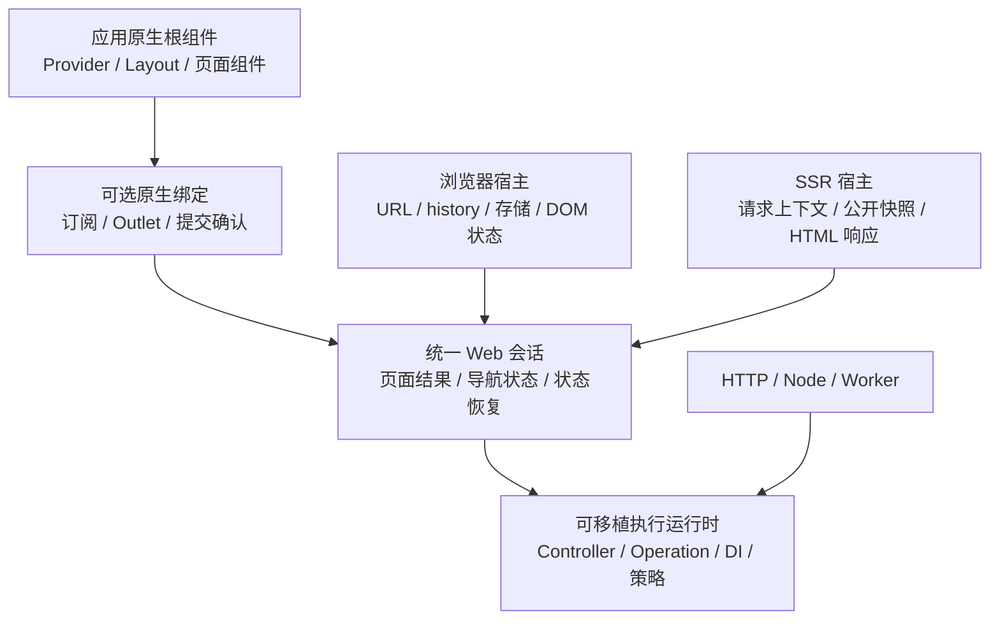

# 原生组件组合与统一导航接入

日期：2026-09-16。状态：架构提案，尚未实施。评估基线：`10fde72e70e8e932a2ae8c191828aea4c60e2632`。

## 1. 目标与约束

应用开发者应使用 React、Vue、Svelte 本来的组件组合和生命周期。FineSoft 提供可移植的业务执行、页面加载、导航和状态恢复。普通页面与 tabs/stack/split 使用同一接入方式。

本轮必须同时降低框架与模板的实现代码量、接入概念数量和联动修改范围。代码迁移到其他目录、打包到另一个包、复制进模板或压缩排版，均不计为职责减少。

沿用已确认约束：允许破坏性 API 调整；同步迁移六个模板和中英文文档；保留 full/minimal 两档及同档位功能一致性；保留 SSR、CSR、prerender、导航守卫、会话/草稿恢复、多实例、独立数据操作和 Node/Worker 边界。

## 2. 当前证据

### 2.1 源码变化

同一口径统计 Git 跟踪的运行包 `src` 与六模板 `src`：TS/JS/原生组件/CSS 的物理行数，包含注释和空行，排除 `.d.ts`、测试、文档、配置和构建产物。文件移动仍在总数中。

| 范围           | 原重构前 `e22de64` | 当前 `10fde72` |   增量 |
| -------------- | -----------------: | -------------: | -----: |
| 六个运行包实现 |             14,289 |         15,451 | +1,162 |
| 六个模板实现   |              3,404 |          3,822 |   +418 |
| 合计           |             17,693 |         19,273 | +1,580 |

模板统一前 `63be759` 的模板实现为 3,193 行。统一模板这一轮增加 629 行，其中包含补齐功能。这里与早期验收报告的个位数差异来自排除声明文件的统计口径，不能把两个口径拼接比较。

当前 full 的 `main/ssr/app-definition/views` 每套 57 行，minimal 加上 `instance` 后每套 138 行。这只是装配文件统计；组件内的状态订阅、动作透传和页面分发也必须计入接入成本。

### 2.2 结构问题

| 证据位置                                    | 当前行为                                                       | 带来的问题                                              |
| ------------------------------------------- | -------------------------------------------------------------- | ------------------------------------------------------- |
| `templates/*/src/views.ts`                  | full 注册 `"*": App`，minimal 配 `mode: "entries"` 和 `chrome` | 接入模型按示例档位分裂                                  |
| full 的 `App`、`PageRenderer`、`actions.ts` | 逐层传 `onAction`，再 switch 页面类型                          | 同一导航需要额外动作对象和第二份视图分发表              |
| minimal 的 `App`、`lib/navigation.ts`       | 传整个 BrowserAppHandle，组件自己读导航树                      | 展示层依赖宿主和树的内部形状                            |
| `browser/src/start-app.ts`                  | 按 renderer.mode 切换渲染算法，并决定是否暴露 navigation       | UI 选择改变导航 API 的可用性                            |
| `browser/src/navigation-islands.ts`         | 按页面创建根、移除/插回 DOM、手动保存滚动和销毁视图            | 基础框架接管原生框架的组件树                            |
| `front/src/renderers/*`                     | 每框架分别实现 mount/hydrate/update/dispose/ready              | 原生差异与页面调度耦合                                  |
| `ssr/src/render.ts` 与 `navigation.ts`      | 单页与结构化页面保留两套 SSR 流程                              | 请求准备、上下文、错误和结果组装重复                    |
| minimal 的 `createNavigation(url)`          | 再次用正则解析路由，错误页手动 hydrate 整棵树                  | 路由知识重复，普通跳转无法统一恢复应用结构              |
| `core/src/application/runtime.ts`           | 已有操作实现表，再包装成 IntentController 注册第二张表         | 输入先包装为 `{ input }` 再拆开；额外分发层没有独立策略 |

### 2.3 实际组件组合验证

使用当前构建的公开 renderer，分别运行 React Context、Vue provide/inject、Svelte setContext/getContext 的 SSR 探针。布局提供 `shared`，页面读取相同上下文。[本轮观察记录](../../../reports/native-composition-audit/observed-results.json)单独保留这些结果与统计口径。

| 原生框架 | 当前 entries 布局读取 | 当前 entries 页面读取 | 同一原生根的页面读取 |
| -------- | --------------------- | --------------------- | -------------------- |
| React    | shared                | missing               | shared               |
| Vue      | shared                | missing               | shared               |
| Svelte   | shared                | missing               | shared               |

这验证了 SSR 的组件树边界问题，不代表已经验证浏览器修复。浏览器代码同样为 chrome 和各 entry 单独 mount；后续实现必须补浏览器组件树验证。

## 3. 方案选择

| 方案                                 | 应用侧成本                                     | 框架侧成本                                       | 结论                                     |
| ------------------------------------ | ---------------------------------------------- | ------------------------------------------------ | ---------------------------------------- |
| 原生单根 + 框架无关会话 + 可选薄绑定 | 使用原生启动、布局和组件；绑定负责重复订阅代码 | 每 UI 只保留状态订阅、Outlet 和提交确认          | 推荐                                     |
| 完全移除原生绑定                     | 每个应用自行实现订阅、key、SSR 快照和提交确认  | 框架不含原生导入                                 | 会把维护成本转移给应用，不能作为默认接入 |
| 保留当前 renderer，增加统一入口包装  | 表面调用更短                                   | root/entries、chrome、多根和原生更新协议继续存在 | 无法解决已复现的组件组合问题             |

不承诺原生绑定永远无需随大版本更新。目标是仅在原生公开 API 确实变化时调整这一小层；新增路由、导航结构、守卫、session 或运行环境，不应改三份原生绑定。

## 4. 责任边界



### 基础框架

- Core/Web/Browser/SSR 均不导入 React、Vue、Svelte。
- Web 会话拥有导航事务和页面结果；浏览器负责 history/持久化，SSR 负责请求及输出物化。
- 导航控制器已有的页面缓存是保留页面结果的唯一所有者。供 UI 读取的快照是其派生视图，不再维护第二套同步状态。
- DOM 草稿和滚动恢复只操作明确标记的元素，不创建或销毁原生组件根。

### 原生应用与可选绑定

- 应用用原生 API 创建或水合一个根；应用布局包住 Outlet。React Provider、Vue provide、Svelte context 自然覆盖布局和页面。
- 原生框架根据稳定 EntryId 创建、保留和销毁页面组件。导航隐藏页面与离开导航树区分；隐藏保留实例，出树移除实例。
- 一个逻辑页面仍保留在树中时，使用 keyed 原生节点控制可见性；跨标签不通过 detach/reattach 原生根保活。
- 绑定只消费快照、订阅变更、渲染选中的原生组件，并确认对应 revision 已提交。它不识别 stack/tabs/split，不执行路由、守卫、session 或业务操作。
- React 使用外部 store 订阅及原生提交边界；Vue/Svelte 使用各自公开的响应式和提交 API。取消订阅随组件生命周期自动完成。

## 5. 两种导航的一套接入

### 固定行为

1. 普通 URL 页面以单栈表达；tabs/split 是同一导航模型的结构组合。
2. 所有应用都有同一个 `navigation` 命令入口，不由渲染配置决定。
3. URL 跳转、代码目标、浏览器返回、SSR 深链和错误页恢复，共用目标解析和导航事务。
4. 改普通导航为 tabs 时，修改导航声明和业务导航控件；浏览器入口、SSR 入口、页面 props 和原生绑定不变。
5. UI 消费页面条目、可见性和导航摘要。普通控件不遍历原始树来判断返回按钮或选中标签；高级树操作仍通过明确的 Web 接口使用。

### 应用接入示意

以下是拟采用的调用形状，用于评审；当前版本尚未提供这些新接口。

```tsx
// App.tsx：full 与 minimal 都采用这一种组件组合。
import { Outlet, useSnapshot } from "@finesoft/front/react";
import { views } from "./views";

export function App({ app }) {
    const snapshot = useSnapshot(app);
    return (
        <AppProviders>
            <Layout navigation={app.navigation} state={snapshot.navigation}>
                <Outlet app={app} views={views} />
            </Layout>
        </AppProviders>
    );
}
```

Vue/Svelte 使用各自原生组件和 slot/snippet。它们接收同样的应用会话和视图表；没有 renderer.mode、mountChrome 或按档位分配的根组件角色。

浏览器的宿主准备与原生 mount/hydrate 分离。下面的启动代码适用于同一 UI 框架的两种导航结构；导航结构不出现在启动参数里。

```tsx
// main.tsx
import { createRoot, hydrateRoot } from "react-dom/client";
import { createBrowserApp } from "@finesoft/front/browser";
import { definition } from "./app-definition";
import { App } from "./App";

const target = document.getElementById("app")!;
const app = await createBrowserApp({ definition, target });
const root = app.hydrate ? hydrateRoot(target, <App app={app} />) : createRoot(target);
if (!app.hydrate) root.render(<App app={app} />);

import.meta.hot?.dispose(async () => {
    try {
        await app.dispose();
    } finally {
        root.unmount();
    }
});
```

`createBrowserApp` 返回时首屏数据已准备好，不等待尚未挂载的原生根。首次原生提交由 Outlet 确认，宿主据此启动 session 恢复；应用无需手动安排恢复时序。销毁时先捕获/保存原生业务状态并停止宿主，再销毁根；清理失败也要销毁原生根。

SSR 用同一个 App 和视图表，一次性进行原生服务端渲染，随后由标准 SSR 宿主组装 HTML：

```tsx
// ssr.tsx
import { renderToString } from "react-dom/server";
import { createSSRRender } from "@finesoft/front/ssr";
import { definition } from "./app-definition";
import { App } from "./App";

export const render = createSSRRender({
    definition,
    render: (app) => renderToString(<App app={app} />),
});
export { serializeServerData } from "@finesoft/front/ssr";
```

可选绑定在 SSR 读取同一份初始快照；不会创建浏览器宿主。SSR 回调接收可供组件读取的 Web 会话视图，组件事件使用同一命令形状；服务端不会触发点击或修改浏览器 history。HTML 渲染回调可返回字符串或带 head/css 的结果，以保留 Vue/Svelte 的原生能力。

默认链接用真实 `href`。浏览器宿主在应用根范围处理可接管的站内导航，保留修饰键、新窗口、download、target 和跨站链接行为。程序化跳转调用同一导航入口。显式数据驱动的 Action 可以委托该入口，不再形成第二套导航执行规则。

### 页面与路由声明

- 保留 `BaseController` 的类型化执行、DI 和 fallback；函数 handler 继续受同一执行规则约束。
- 操作身份只声明一次。控制器作为实现时不再被要求重复实例级 `intentId`；Page 定义与普通 Operation 绑定提供身份。
- 页面声明持有自己的路由信息；应用登记页面集合，消除平行的 controllers 和 routes 注册表。一个页面的多个 URL、不同守卫和无 URL 页面仍能显式表达。
- Web 定义继续不导入原生组件。`pageType` 选择视图，操作 id 选择业务，EntryId 标识实例；三者语义保留。
- 导航结构回调接收已解析、校验的路由结果及类型化目标，消除模板中第二次正则解析 URL。模板中的错误页通过普通导航返回，不直接 hydrate 一棵手工拼装的树。

## 6. 生命周期与行为保留

- 初始 SSR 快照与浏览器水合快照一致。持久化恢复等待原生水合提交和首屏 session provider 登记完成；不会因父子 effect 的顺序先覆盖尚未登记的业务状态。
- 导航状态提交与视图提交分别有清晰边界。滚动和 DOM 草稿恢复等待对应 revision 的原生提交确认；旧导航的迟到确认不会覆盖新状态。
- 不使用固定延迟、下一个微任务或 requestAnimationFrame 代替原生提交确认。
- SSR 一次请求共用其执行作用域；公开结果在释放请求资源前物化；拒绝访问不会把候选页面数据写入 HTML。
- Controller 执行范围、页面实例寿命、浏览器 history 寿命分别由现有对应所有者负责。缩短接入代码不能以共享请求状态或提前释放流资源为代价。
- 模板的姓名等业务状态使用原生状态；session 的捕获/恢复回调连接到该状态。删除仅用于转发到原生 state 的手写 NameStore，不新增通用状态管理库。

## 7. 删除清单

以下为已经定位的现有代码量，表示替换或删除对象的大小，**不是净减少预测**。需要迁移的类型、实际能力和新增绑定代码必须从删除量中扣除。

| 对象                                                       | 当前行数 | 处理方式                                                       |
| ---------------------------------------------------------- | -------: | -------------------------------------------------------------- |
| 单页 SSR `render.ts` + `create-render.ts`                  |      331 | 使用统一快照 SSR 流程，删除平行执行路径                        |
| renderer options/props/共享原生 SSR + BrowserRenderer 协议 |      119 | 改为会话快照和原生组件组合，删除 mountChrome/root/entries 协议 |
| 三框架 browser/server renderer                             |      204 | 删除六个命令式 renderer；替换为三份范围受限的可选原生绑定      |
| browser/SSR/Web 的 islands 根管理                          |      239 | 原生组件树拥有页面实例；删除手工多根、shell 和 HTML 片段组合   |
| full 的 actions.ts + PageRenderer                          |      139 | 视图表选取页面，链接使用 href；业务导航文案保留在布局数据中    |
| minimal 的 NameStore/instance 代码                         |      144 | 原生状态 + session 捕获/恢复，删除额外订阅集合                 |

另有 `start-app.ts` 中的按模式分支、重复 ViewProps 透传、模板 URL 再解析和 Runtime 的第二张 Intent 分发表，需在对应迁移中删除。删除旧调用方后同时删除旧出口和专为旧分支编写的夹具；旧行为的有效断言迁入新入口测试。

不保留长期兼容双实现；保留原生框架适配所必需的公开 API 调用。不会为统一命名增加一个转发门面而留下上述所有旧层。

## 8. 验收标准

### 代码与接入成本

- 以本提案的当前基线为本轮对照：运行实现 **少于 15,451 行**，六模板实现合计 **少于 3,822 行**，两者分别净减少。
- 同时记录语法层面非注释 token、文件数和调用路径；不能靠删注释、合并空行、移动文件或改变统计口径满足净减少。
- 新增页面只涉及其业务实现、页面声明和原生视图表；不修改浏览器入口、SSR 入口、原生绑定或额外 PageRenderer 分支。
- 普通导航改成 tabs/split，仅导航声明和业务控件变化。不存在 `mode: root/entries`、`chrome` 或可选的 `navigation` 宿主接口。
- 任何新增通用辅助层都必须列出它替代并删除的原有职责。最终报告分别给出新增、删除、净变化，而不是只报模板缩短。

### 实际使用验证

1. 六模板独立生成、安装、类型检查、客户端/SSR 构建，仍能从发布入口使用。
2. React/Vue/Svelte 的原生 Context/Provider 贯穿 Layout 与页面；浏览器和 SSR 均验证。更新上下文、切页、返回后保持正确。
3. 同一 App 的普通导航与 tabs/stack/split：深链、错误恢复、刷新、后退/前进、异步导航竞争、守卫拒绝和重定向。
4. 页面 key、隐藏保活、离栈销毁、页面类型变化重置；布局自己的状态不因页面变化被销毁。
5. 原生水合和提交、页面草稿/全局资料恢复、滚动恢复；旧 revision 的迟到结果不能覆盖当前页。
6. 真实链接的点击、修饰键、新标签、下载和外部跳转；多个应用根独立运行和销毁。
7. SSR/CSR/prerender、错误状态码、公开数据投影和请求释放；独立 HTTP、Node/Worker 能力不因 UI 重构引入原生依赖。
8. 对相同功能、相同构建配置重新测六模板客户端包体；SSR 响应测量使用生产环境。报告实测差异，不把不同功能或不同入口范围称为优化。

这些是实施后的交付标准。当前只完成源码统计和组件组合问题的 SSR 复现，尚未完成新方案实现或浏览器验收。

## 9. 实施顺序

1. 固定现有行为与成本基线；补原生组件组合和两类导航同入口的失败样例。
2. 将统一 Web 会话与原生挂载解耦，建立稳定快照和提交确认。
3. 先迁移同一原生框架的 full/minimal，证明入口一致、原生组合与净删减可同时成立；再迁移另两框架。
4. 统一 SSR 和 URL/目标解析，删除旧 renderer、islands 和重复调度路径。
5. 完成控制器/页面声明的重复消除、六模板原生状态接入、文档与脚手架迁移。
6. 验证所有保留行为，报告框架、模板、原生绑定和客户端产物的实际成本。授权之外的 push、发布、部署和 CI 调整不在本提案内。

## 10. 原生公开契约参考

- [React useSyncExternalStore](https://react.dev/reference/react/useSyncExternalStore)：外部快照、订阅、不可变引用和 SSR 初始快照要求。
- [React createRoot](https://react.dev/reference/react-dom/client/createRoot)：原生根的创建与所有权。
- [Vue provide/inject](https://vuejs.org/guide/components/provide-inject.html)：组件祖先向后代提供依赖。
- [Svelte context](https://svelte.dev/docs/svelte/context)：组件树内的上下文传递。

本仓库安装版本上的 SSR 探针是第 2.3 节结论的直接依据；官方文档用于确定拟采用的公开接入契约。
