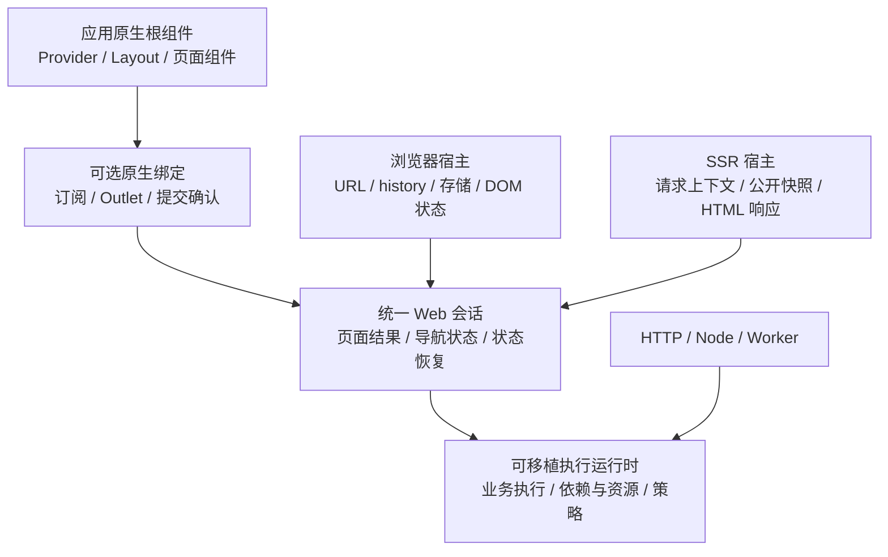

# 框架整体简化与原生应用接入

日期：2026-09-16；实施复核：2026-09-19。状态：本地实施与功能验证完成（2026-09-20）；性能逐项实测见验收记录。评估基线：`10fde72e70e8e932a2ae8c191828aea4c60e2632`。本次修订将范围扩展到重构前已有的框架设计与实现；文件路径沿用，方便继续评审。

实施记录：[实施计划](../plans/2026-09-19-native-composition.md)。按用户要求，先完成实现，再统一新增、迁移和运行测试；此前的观察记录保留，生产基线在最终验证时从原提交独立重建。

## 1. 目标与约束

本轮覆盖整个现有框架：重构前的基础抽象、此前新增的执行与宿主边界、原生框架接入、六个模板、脚手架和文档。旧 API、类继承体系、包划分和上一版设计，都需要说明其继续存在的理由。原生组件组合与导航接入是整体调整的一部分。

目标是让基础框架用较少的机制承担可移植业务执行、页面加载、导航和状态恢复。应用使用 React、Vue、Svelte 本来的组件组合和生命周期；普通页面与 tabs/stack/split 使用同一接入方式。后续增加运行环境、数据接口、页面组织或业务能力时，修改应落在对应职责内。

本轮必须同时降低框架与模板的实现代码量、接入概念数量和联动修改范围。代码迁移到其他目录、打包到另一个包、复制进模板或压缩排版，均不计为职责减少。

框架优化还包括执行效率、首屏加载、导航更新、资源占用和开发体验。第 8 节分别列出措施与可测目标；职责重划和源码减少本身不能证明运行更快、包体更小或内存更低。

沿用已确认约束：允许破坏性 API 调整；同步迁移六个模板和中英文文档；保留 full/minimal 两档及同档位功能一致性；保留 SSR、CSR、prerender、导航守卫、会话/草稿恢复、多实例、独立数据操作和 Node/Worker 边界。

保留的是已需要的能力及其可验证行为。实现这些能力的 `Framework`、`IntentDispatcher`、`BaseController`、`Container`、导航控制器等现有对象，都纳入取舍。每项替换都需要完成调用方迁移和旧实现删除，不能在新入口下继续保留完整旧执行链。

## 2. 当前证据

### 2.1 源码变化

同一口径统计 Git 跟踪的运行包 `src` 与六模板 `src`：TS/JS/原生组件/CSS 的物理行数，包含注释和空行，排除 `.d.ts`、测试、文档、配置和构建产物。文件移动仍在总数中。

| 范围           | 原重构前 `e22de64` | 当前 `10fde72` |   增量 |
| -------------- | -----------------: | -------------: | -----: |
| 六个运行包实现 |             14,289 |         15,451 | +1,162 |
| 六个模板实现   |              3,404 |          3,822 |   +418 |
| 合计           |             17,693 |         19,273 | +1,580 |

模板统一前 `63be759` 的模板实现为 3,193 行。统一模板这一轮增加 629 行，其中包含补齐功能。这里与早期验收报告的个位数差异来自排除声明文件的统计口径，不能把两个口径拼接比较。

当前 full 的 `main/ssr/app-definition/views` 每套 57 行，minimal 加上 `instance` 后每套 138 行。这只是装配文件统计；组件内的状态订阅、动作透传和页面分发也必须计入接入成本。

### 2.2 结构问题

| 证据位置                                    | 当前行为                                                       | 带来的问题                                              |
| ------------------------------------------- | -------------------------------------------------------------- | ------------------------------------------------------- |
| `templates/*/src/views.ts`                  | full 注册 `"*": App`，minimal 配 `mode: "entries"` 和 `chrome` | 接入模型按示例档位分裂                                  |
| full 的 `App`、`PageRenderer`、`actions.ts` | 逐层传 `onAction`，再 switch 页面类型                          | 同一导航需要额外动作对象和第二份视图分发表              |
| minimal 的 `App`、`lib/navigation.ts`       | 传整个 BrowserAppHandle，组件自己读导航树                      | 展示层依赖宿主和树的内部形状                            |
| `browser/src/start-app.ts`                  | 按 renderer.mode 切换渲染算法，并决定是否暴露 navigation       | UI 选择改变导航 API 的可用性                            |
| `browser/src/navigation-islands.ts`         | 按页面创建根、移除/插回 DOM、手动保存滚动和销毁视图            | 基础框架接管原生框架的组件树                            |
| `front/src/renderers/*`                     | 每框架分别实现 mount/hydrate/update/dispose/ready              | 原生差异与页面调度耦合                                  |
| `ssr/src/render.ts` 与 `navigation.ts`      | 单页与结构化页面保留两套 SSR 流程                              | 请求准备、上下文、错误和结果组装重复                    |
| minimal 的 `createNavigation(url)`          | 再次用正则解析路由，错误页手动 hydrate 整棵树                  | 路由知识重复，普通跳转无法统一恢复应用结构              |
| `core/src/application/runtime.ts`           | 已有操作实现表，再包装成 IntentController 注册第二张表         | 输入先包装为 `{ input }` 再拆开；额外分发层没有独立策略 |

### 2.3 实际组件组合验证

使用当前构建的公开 renderer，分别运行 React Context、Vue provide/inject、Svelte setContext/getContext 的 SSR 探针。布局提供 `shared`，页面读取相同上下文。[本轮观察记录](../../../reports/native-composition-audit/observed-results.json)单独保留这些结果与统计口径。

| 原生框架 | 当前 entries 布局读取 | 当前 entries 页面读取 | 同一原生根的页面读取 |
| -------- | --------------------- | --------------------- | -------------------- |
| React    | shared                | missing               | shared               |
| Vue      | shared                | missing               | shared               |
| Svelte   | shared                | missing               | shared               |

这验证了 SSR 的组件树边界问题，不代表已经验证浏览器修复。浏览器代码同样为 chrome 和各 entry 单独 mount；后续实现必须补浏览器组件树验证。

### 2.4 重构前机制与后来新增机制的交叠

| 证据位置                                                                                 | 当前行为                                                                       | 调整依据                                               |
| ---------------------------------------------------------------------------------------- | ------------------------------------------------------------------------------ | ------------------------------------------------------ |
| `core/src/application/runtime.ts`、`intents/*`                                           | 操作实现已经归一化，执行仍经过旧 IntentDispatcher；控制器重复声明 intentId     | 业务执行身份、查找和调用应各有一处定义                 |
| `core/src/dependencies/container.ts`                                                     | 字符串 register/resolve 与 token registerProvider/get 使用不同注册表与解析路径 | 生命周期和依赖配置应使用一套机制                       |
| `web/src/framework.ts`、`dependencies/make-dependencies.ts`                              | Framework 建容器并装配默认服务，执行作用域再次装配后复制部分依赖               | Web 装配不应建立第二套依赖所有权                       |
| `web/src/framework.ts`、`core/src/application/runtime.ts`                                | 页面访问走 MetricsRecorder，操作事件走 EventRecorder                           | 应用配置一处事件记录器应覆盖两类事件                   |
| `web/src/navigation/codec.ts`、`router/router.ts`、`application/load-page.ts`            | 导航解析器与页面加载读取 `pattern → intentId` 文本摘要，另外匹配路由           | 可读的调试文本不应承担路由数据协议                     |
| `web/src/session/navigation-adapter.ts`、`browser/src/session-bridge.ts`                 | URL 与导航树的恢复分成两套 adapter 和处理分支                                  | 普通页面和组合导航应共享恢复模型                       |
| `web/src/protocol.ts`、`ssr/src/navigation.ts`、`browser/src/start-app.ts`               | 用特殊 Intent `@finesoft/navigation-tree` 携带导航树                           | 页面数据与框架控制数据需要明确字段，消除哨兵查找和转换 |
| `core/src/http/*`、`dependencies/make-dependencies.ts`、`server/src/internal-fetch.ts`   | 原始 fetch、Net、HttpClient、受控 fetch 与 SSR 内部请求分别存在                | 区分必要策略与纯转发，删除没有独立行为的封装           |
| `server/src/create-server.ts`、`start.ts`、`app.ts` 与 `http.ts`、`node.ts`、`worker.ts` | 旧启动流程与显式宿主流程并存                                                   | 环境差异应只留在监听、能力注入与构建产物处             |
| `web/src/models/shelf.ts`、默认依赖与公开 barrel                                         | 基础包带货架/条目 UI 数据约定，并集中安装多种可选服务                          | 按责任和实际使用判断归属，缩小应用必须了解的 API 面    |

针对当前构建的公开入口又运行了两个断言探针，结果也存入第 2.3 节的观察记录：

- 同名字符串 `service` 与 token `service` 分别注册后，`resolve` 和 `get` 返回不同对象。这确认了两套解析通道；单凭这个结果不能认定存在依赖串用故障。
- 只配置自定义 EventRecorder，执行首页并调用 `didEnterPage`：自定义记录器收到 operation 的开始/完成事件，PageView 仍进入默认控制台 Metrics。记录器配置确实未覆盖全部框架事件。

其他行是沿当前源码调用链得到的结构证据。是否删除某项能力，仍以实际责任和验收场景判断；仓库内没有调用方不等于仓库外无人使用。

### 2.5 数据一致性、提交与接口边界

继续用现有本地公开构建运行了[一致性探针](../../../reports/native-composition-audit/consistency-probes.mjs)，[结果](../../../reports/native-composition-audit/consistency-results.json)如下。它们补充前两轮的结构和性能证据。

| 实际调用                                                                          | 观察结果                                              | 结论                                                                      |
| --------------------------------------------------------------------------------- | ----------------------------------------------------- | ------------------------------------------------------------------------- |
| 同一缓存 query，先输入一月的 Date，再输入二月的 Date                              | handler 只执行一次，第二次返回一月结果                | 默认缓存键把 Date 编为相同空对象，输入域与编码契约不匹配                  |
| 页面读取值 1；command 改为 2 并 `context.invalidate(["value"])`；跳到另一页后返回 | 页面仍为 1；显式 `navigation.refresh()` 后才为 2      | 数据查询失效与保留页面失效没有贯通，应用需要协调两层缓存                  |
| 导航的第一个订阅回调抛错，再切页                                                  | 新页已提交，导航 Promise 却拒绝，第二个订阅未收到通知 | 提交结果与观察者失败混合，其他消费者可能看不到已提交状态                  |
| operation 抛出 HttpError，经标准 HTTP handler 输出                                | 400/403/404 被分类；401/409/429 都输出 500/failure    | 现有错误模型表达不了这些业务失败；不能据此把所有上游 HTTP 状态原样公开    |
| HTTP 声明 `/items/:id`，请求 `/items/42`                                          | 返回 404，endpoint 未执行                             | 数据接口当前明确只匹配精确路径，尚不具备 Web 的参数路由能力；这是能力边界 |

缓存输入探针没有使用自定义 `cache.key`。源码中的 `stableStringify` 对其他非普通 JSON 对象及循环/过深输入也采用宽容处理，不能直接把这种处理当成无碰撞的业务身份。导航测试不涉及浏览器 DOM，证明的是会话提交与通知的行为。

## 3. 整体取舍

### 3.1 对现有机制的处理决定

下表是实施目标；其中涉及 API 的名字和签名需与下游迁移一同落定。每行都要移除相应重复职责，不能只加转发接口。

| 责任               | 目标做法                                                                                     | 替换或删除的现有机制                                                                              | 必须保留的能力                                                                     |
| ------------------ | -------------------------------------------------------------------------------------------- | ------------------------------------------------------------------------------------------------- | ---------------------------------------------------------------------------------- |
| 业务执行           | 定义归一化后直接调用同一种 handler(input, context)                                           | IntentDispatcher 的第二张实现表、Intent 输入包裹/拆解、重复 intentId；移除 Framework 的转发执行链 | 类型与输入输出校验、策略、取消、错误分类、缓存隔离                                 |
| 控制器             | BaseController 作为可选的 execute/fallback 辅助，归入同一 handler 契约；函数不必继承类       | IntentController 身份要求、单独的 Intent perform 协议、Container 与 context 重复传参              | 类组织业务的方式、业务错误回退；取消不能被 fallback 吞掉                           |
| 依赖与资源         | 使用一套 token/provider、解析缓存和作用域；Web 使用执行上下文提供的依赖                      | 字符串注册通道、基于字符串的 request-scoped-key、第二个 Web 容器、重复 makeDependencies           | runtime/scope/transient 生命周期、异步创建去重、循环检查、按依赖顺序释放、请求隔离 |
| 页面与导航         | 页面声明关联路由；共享类型化目标解析、导航事务及结构化路由表                                 | controllers/routes 平行登记、从调试字符串反推路由、FlowAction 自有的导航执行链与临时导航控制器    | 普通页面和 stack/tabs/split、深链与反向路由、不同阶段的守卫、数据驱动导航          |
| 导航与恢复         | 同一导航模型表达普通页与组合页；快照明确区分导航位置、页面数据和持久化业务状态               | URL-only session 执行分支、用特殊 Intent 承载导航树、反复转换旧 PrefetchedIntent 格式的桥接代码   | entry 身份、协议版本与构建检查、刷新/返回、草稿恢复、受控公开数据                  |
| 渲染               | 原生框架拥有组件树，基础框架负责数据与导航；SSR 从同一会话快照产出结果                       | 命令式多根 renderer、islands、root/entries 双模式、单页/组合页两套 SSR 调度                       | SSR/CSR/prerender、上下文继承、页面保活、提交后滚动恢复                            |
| 网络               | 执行上下文提供宿主注入的 fetch；只在必要位置添加请求策略与可选 HTTP 便利函数                 | Net 纯转发接口、重复默认 fetch 登记和包装；评估替换强制继承的 HttpClient 入口                     | 取消、拦截、错误解析、目标与重定向限制、SSR 内部请求、流响应                       |
| 事件与日志         | operation 与页面访问共用 EventRecorder；诊断日志保留等级与独立输出用途                       | MetricsRecorder 及其默认实现；取消 Logger 为模板插值返回字符串的约定，精简仅转发的基类            | 可配置记录器、关联字段、warn/error 上报、释放时刷出数据                            |
| 宿主与构建         | 业务入口使用 Request→Response；开发入口装配 Vite，宿主入口负责能力和监听，构建适配器负责产物 | 被显式宿主替代的旧生产启动路径、重复 Vite 创建与环境判断；按调用方迁移后删除                      | Node/Worker/Edge、独立数据接口、现有部署目标、静态与缓存策略、优雅停止             |
| 默认服务与数据模型 | locale、翻译、平台信息等按需使用；业务展示模型由应用声明                                     | 必选启动链中的可选服务安装；框架内货架/条目与 Action 绑定的业务形状；无独立用途的公开别名         | 国际化、日志等实际可用能力；页面数据类型与安全的公开投影                           |

BaseController 的保留理由是它对类式业务组织和 fallback 有独立用途，其旧分发协议没有同等保留理由。此前补回文档表示旧功能应被正确说明，并不表示该 API 免于调整。

操作定义与实现分离、模块分组、宿主覆盖仍可用于确实需要独立契约的场景；普通页面和本地操作直接声明实现，不要求额外注册一套工厂或模块。以上分工也不意味着每行新建一个包或服务。

### 3.2 简化后的主链

```text
独立数据调用：Operation → 执行作用域（校验/策略/依赖）→ handler → 输出
Web 页面访问：解析目标 → 导航事务（守卫/加载/提交）→ 会话快照
页面加载：复用上面的业务执行链
浏览器：history 与真实链接 → 同一导航事务 → 原生组件提交
SSR：Request → 同一页面准备过程 → 公开快照 + 一次原生渲染 → Response
```

Core 的执行上下文、Web 的页面会话和原生组件状态有不同寿命。它们通过输入输出连接；每种状态有一个明确所有者。调整不引入同时管理执行、UI、持久化和网络的全局对象，也不以合并不同阶段的策略来缩短代码。

### 3.3 原生接入方案

| 方案                                 | 应用侧成本                                     | 框架侧成本                                       | 结论                                     |
| ------------------------------------ | ---------------------------------------------- | ------------------------------------------------ | ---------------------------------------- |
| 原生单根 + 框架无关会话 + 可选薄绑定 | 使用原生启动、布局和组件；绑定负责重复订阅代码 | 每 UI 只保留状态订阅、Outlet 和提交确认          | 推荐                                     |
| 完全移除原生绑定                     | 每个应用自行实现订阅、key、SSR 快照和提交确认  | 框架不含原生导入                                 | 会把维护成本转移给应用，不能作为默认接入 |
| 保留当前 renderer，增加统一入口包装  | 表面调用更短                                   | root/entries、chrome、多根和原生更新协议继续存在 | 无法解决已复现的组件组合问题             |

不承诺原生绑定永远无需随大版本更新。目标是仅在原生公开 API 确实变化时调整这一小层；新增路由、导航结构、守卫、session 或运行环境，不应改三份原生绑定。

### 3.4 补齐一致性与边界契约

这五项归入已有的执行、导航和宿主职责，优先解决正确性与接入负担。

1. **缓存身份必须可靠。** 明确默认键支持的值域；未支持的 Date/Map/类实例等要求显式 `cache.key`，或经声明的编码转换。循环、深度超限和不可编码输入明确失败，不能生成占位字符串参与缓存命中。缓存身份与诊断输出、持久化数据有不同约束，复用编码基础时也必须保持各自契约。先修正这一点，再实现第 8 节的并发查询合并。
2. **一次失效传播到对应页面结果。** 应用表达一次数据失效，执行缓存与关联 Web 会话都能收到。初版可保守地使关联会话的保留页面结果失效，下次加载/返回重新走既有加载事务；原生页面实例、输入草稿与滚动状态继续保留。细粒度的数据依赖追踪只有测量证明值得时再引入；不新增全局状态系统。当前页主动刷新复用现有 refresh 语义，并明确失效期间进行中结果的提交规则。
3. **区分提交前失败、提交后通知和渲染失败。** 守卫拒绝和加载失败在提交前处理；普通订阅者异常隔离并报告，剩余订阅者仍收到快照。history 写入、原生提交等必需宿主步骤与普通观察者分开，不能把它们的失败静默吞掉。调用结果与错误必须说明状态是否已提交，渲染失败由相应错误边界处理，避免应用误把 Promise 拒绝当成导航从未发生。
4. **业务错误可表达，传输映射一致。** 在现有执行错误模型中表达未认证、业务冲突、限流等确实需要的失败，区分可公开信息与内部 cause。直接调用、Web 页面和 HTTP 出口保留相同业务含义，由宿主决定状态码及页面表现；来自上游服务的 HttpError 需要明确转换，未知异常继续隐藏内部细节。函数与 BaseController 使用同一规则。
5. **数据接口复用纯路由能力。** 从现有 Web Router 中复用路径编译、参数解码和校验，让独立 HTTP 接口支持参数路径；保持明确的匹配优先级、冲突检查与方法分派。页面守卫、导航、渲染不进入 HTTP 路由，数据操作也不因此依赖 Web 会话。已有精确路径保持简单的匹配路径，模板需要的常规接口不另建一套路由解析。

此外，有界缓存实现应先复用仓库已有 `core/src/utils/lru-map.ts`，补足必要的迭代与容量校验；不能因为重构就再造一个功能相同的缓存基础类。

实施复核补充：归一化后的实现映射继续保留宿主 override 的选择规则，不能改为直接调用声明上的 handler。查询合并仅在同一 execution、各调用完成自身校验及策略后发生；失效推进代次，新调用不能加入旧 Promise，旧结果不得回填，完成和失败都释放进行中记录。完成态缓存使用有界 LRU，淘汰不取消原调用。字符串依赖迁移为显式 token 与异步 `context.get`，不设置隐式字符串兼容通道。

纯路径匹配先按编码后的路径分段，再对捕获参数解码一次；畸形编码明确视为无效输入，`%2F` 不被提前拆成两个路径段。Web 保留声明顺序和校验失败后继续匹配的语义。HTTP 先收集结构匹配以生成 405/Allow，再按方法和声明顺序校验参数；拒绝同方法同形状的重复路径。新增业务错误使用显式安全类别，上游 HttpError 的 body/cause 不直接成为公开响应。

## 4. 责任边界



### 基础框架

- Core/Web/Browser/SSR 均不导入 React、Vue、Svelte。
- 执行运行时拥有业务作用域、依赖解析和资源释放。Web 通过上下文使用它，不另建默认容器或重走 Intent 分发。
- Web 会话拥有导航事务和页面结果；浏览器负责 history/持久化，SSR 负责请求及输出物化。现有 Framework 门面中的独立职责分别归入这些边界，迁移完删除旧装配链。
- 页面结果只有一个缓存所有者，UI 快照由其派生。现有导航控制器的接口与实现也纳入调整，不因它已承担缓存就固定保留整个类。
- SSR 传输快照显式承载导航树与按 entry 关联的公开页面数据；session 从同一位置模型捕获恢复。持久化数据使用自己的版本和业务状态投影，不直接持久化运行时或整个原生 UI 状态。
- DOM 草稿和滚动恢复只操作明确标记的元素，不创建或销毁原生组件根。

### 原生应用与可选绑定

- 应用用原生 API 创建或水合一个根；应用布局包住 Outlet。React Provider、Vue provide、Svelte context 自然覆盖布局和页面。
- 原生框架根据稳定 EntryId 创建、保留和销毁页面组件。导航隐藏页面与离开导航树区分；隐藏保留实例，出树移除实例。
- 一个逻辑页面仍保留在树中时，使用 keyed 原生节点控制可见性；跨标签不通过 detach/reattach 原生根保活。
- 绑定只消费快照、订阅变更、渲染选中的原生组件，并确认对应 revision 已提交。它不识别 stack/tabs/split，不执行路由、守卫、session 或业务操作。
- React 使用外部 store 订阅及原生提交边界；Vue/Svelte 使用各自公开的响应式和提交 API。取消订阅随组件生命周期自动完成。

## 5. 两种导航的一套接入

### 固定行为

1. 普通 URL 页面以单栈表达；tabs/split 是同一导航模型的结构组合。
2. 所有应用都有同一个 `navigation` 命令入口，不由渲染配置决定。
3. URL 跳转、代码目标、浏览器返回、SSR 深链和错误页恢复，共用目标解析和导航事务。
4. 改普通导航为 tabs 时，修改导航声明和业务导航控件；浏览器入口、SSR 入口、页面 props 和原生绑定不变。
5. UI 消费页面条目、可见性和导航摘要。普通控件不遍历原始树来判断返回按钮或选中标签；高级树操作仍通过明确的 Web 接口使用。

### 应用接入示意

以下是本轮实现的接入形状；完整、可运行示例见六套模板。

```tsx
// App.tsx：full 与 minimal 都采用这一种组件组合。
import { Outlet, useSnapshot } from "@finesoft/front/react";
import { views } from "./views";

export function App({ app }) {
    const snapshot = useSnapshot(app);
    return (
        <AppProviders>
            <Layout navigation={app.navigation} state={snapshot.navigation}>
                <Outlet app={app} views={views} />
            </Layout>
        </AppProviders>
    );
}
```

Vue/Svelte 使用各自原生组件和 slot/snippet。它们接收同样的应用会话和视图表；没有 renderer.mode、mountChrome 或按档位分配的根组件角色。

浏览器的宿主准备与原生 mount/hydrate 分离。下面的启动代码适用于同一 UI 框架的两种导航结构；导航结构不出现在启动参数里。

```tsx
// main.tsx
import { createRoot, hydrateRoot } from "react-dom/client";
import { createBrowserApp } from "@finesoft/front/browser";
import { definition } from "./app-definition";
import { App } from "./App";

const target = document.getElementById("app")!;
const app = await createBrowserApp({ definition, target });
const root = app.hydrate ? hydrateRoot(target, <App app={app} />) : createRoot(target);
if (!app.hydrate) root.render(<App app={app} />);

import.meta.hot?.dispose(async () => {
    try {
        await app.dispose();
    } finally {
        root.unmount();
    }
});
```

`createBrowserApp` 返回时首屏数据已准备好，不等待尚未挂载的原生根。首次原生提交由 Outlet 确认，宿主据此启动 session 恢复；应用无需手动安排恢复时序。销毁时先捕获/保存原生业务状态并停止宿主，再销毁根；清理失败也要销毁原生根。

SSR 用同一个 App 和视图表，一次性进行原生服务端渲染，随后由标准 SSR 宿主组装 HTML：

```tsx
// ssr.tsx
import { renderToString } from "react-dom/server";
import { createSSRRender } from "@finesoft/front/ssr";
import { definition } from "./app-definition";
import { App } from "./App";

export const render = createSSRRender({
    definition,
    render: (app) => renderToString(<App app={app} />),
});
export { serializeServerData } from "@finesoft/front/ssr";
```

可选绑定在 SSR 读取同一份初始快照；不会创建浏览器宿主。SSR 回调接收可供组件读取的 Web 会话视图，组件事件使用同一命令形状；服务端不会触发点击或修改浏览器 history。HTML 渲染回调可返回字符串或带 head/css 的结果，以保留 Vue/Svelte 的原生能力。

默认链接用真实 `href`。浏览器宿主在应用根范围处理可接管的站内导航，保留修饰键、新窗口、download、target 和跨站链接行为。程序化跳转调用同一导航入口。显式数据驱动的 Action 可以委托该入口，不再形成第二套导航执行规则。

### 页面与路由声明

- `BaseController` 改为第 3.1 节的可选业务辅助；函数和类使用同一执行上下文、策略和资源机制。
- 操作身份只声明一次。控制器作为实现时不再被要求重复实例级 `intentId`；Page 定义与普通 Operation 绑定提供身份。
- 页面声明持有自己的路由信息；应用登记页面集合，消除平行的 controllers 和 routes 注册表。一个页面的多个 URL、不同守卫和无 URL 页面仍能显式表达。
- Web 定义继续不导入原生组件。`pageType` 选择视图，操作 id 选择业务，EntryId 标识实例；三者语义保留。
- 导航结构回调接收已解析、校验的路由结果及类型化目标，消除模板中第二次正则解析 URL。模板中的错误页通过普通导航返回，不直接 hydrate 一棵手工拼装的树。

## 6. 生命周期与行为保留

- 初始 SSR 快照与浏览器水合快照一致。持久化恢复等待原生水合提交和首屏 session provider 登记完成；不会因父子 effect 的顺序先覆盖尚未登记的业务状态。
- 导航状态提交与视图提交分别有清晰边界。滚动和 DOM 草稿恢复等待对应 revision 的原生提交确认；旧导航的迟到确认不会覆盖新状态。
- 不使用固定延迟、下一个微任务或 requestAnimationFrame 代替原生提交确认。
- 原生绑定先确认对应 revision 已实际提交，宿主随后启动首屏恢复；确认调用不能等待由恢复产生的下一次提交，以免死锁。恢复等待同一原生提交中的 provider 注册完成，迟到 revision 不释放当前导航等待。隐藏 entry 的稳定父级位置和 key 共同保留原生组件；页面离树及同 entry 更换 pageType 时销毁。
- SSR 一次请求共用其执行作用域；公开结果在释放请求资源前物化；拒绝访问不会把候选页面数据写入 HTML。
- 业务执行范围、页面实例寿命、浏览器 history 寿命分别确定唯一所有者，并据此重做现有重叠的管理代码。控制器默认按执行创建；共享资源使用已有 provider 生命周期，不再增加一套控制器生命周期配置。取消、请求隔离和流资源释放必须有实际验证。
- 模板的姓名等业务状态使用原生状态；session 的捕获/恢复回调连接到该状态。删除仅用于转发到原生 state 的手写 NameStore，不新增通用状态管理库。

## 7. 删除清单与迁移完成条件

### 7.1 旧基础的删除对象

| 对象                                                            | 删除完成条件                                                                     |
| --------------------------------------------------------------- | -------------------------------------------------------------------------------- |
| `core/src/intents/dispatcher.ts` 及旧 Intent 调用协议           | 页面和数据操作都直接进入统一 handler；BaseController 接入后无需旧分发表          |
| Container 字符串注册/解析、`dependencies/request-scoped-key.ts` | 默认服务、控制器、SSR 和请求绑定全部迁移到同一依赖与上下文机制                   |
| `web/src/framework.ts` 中的旧装配/转发、两处 makeDependencies   | 每个运行时及执行范围只有一套依赖所有权；不再通过共享字符串 key 复制依赖          |
| 旧 MetricsRecorder、ConsoleMetrics                              | 页面访问与操作事件都经过应用配置的记录器，有相应行为断言                         |
| `navigation/codec.ts` 中的路由摘要解析和重复匹配                | 解析、反向路由和深链共用结构化路由表，参数校验结果一致                           |
| URL session adapter 与 Intent 导航哨兵                          | 两类导航共用恢复入口；SSR 和浏览器读同一显式快照格式；旧格式的迁移或失效策略明确 |
| 旧生产启动路径、Net 及无独立行为的网络转发                      | 当前调用方和生成产物已迁移；取消、目标限制、内部调用、流与停止行为保持           |
| 与 UI 业务形状耦合的基础模型及重复出口                          | 模板以本地模型表达同样业务能力，文档和发布入口同步移除旧依赖                     |

第 3.4 节的补充调整需替换缓存键的静默有损编码路径，贯通框架内的数据与页面失效机制，使应用无需手工协调二者。扩展 HTTP 参数路由时直接复用既有路径解析。观察者隔离和错误映射直接修改现有职责，不通过增加第二层事件总线或执行门面完成。

这些项不以先前重构新增的代码为限。涉及全文件或公共出口的删除，必须由调用方迁移证明可完成；业务模型移到模板不计作总实现减少。

### 7.2 已量化的渲染与模板删除对象

以下为已经定位的现有代码量，表示替换或删除对象的大小，**不是净减少预测**。需要迁移的类型、实际能力和新增绑定代码必须从删除量中扣除。

| 对象                                                       | 当前行数 | 处理方式                                                       |
| ---------------------------------------------------------- | -------: | -------------------------------------------------------------- |
| 单页 SSR `render.ts` + `create-render.ts`                  |      331 | 使用统一快照 SSR 流程，删除平行执行路径                        |
| renderer options/props/共享原生 SSR + BrowserRenderer 协议 |      119 | 改为会话快照和原生组件组合，删除 mountChrome/root/entries 协议 |
| 三框架 browser/server renderer                             |      204 | 删除六个命令式 renderer；替换为三份范围受限的可选原生绑定      |
| browser/SSR/Web 的 islands 根管理                          |      239 | 原生组件树拥有页面实例；删除手工多根、shell 和 HTML 片段组合   |
| full 的 actions.ts + PageRenderer                          |      139 | 视图表选取页面，链接使用 href；业务导航文案保留在布局数据中    |
| minimal 的 NameStore/instance 代码                         |      144 | 原生状态 + session 捕获/恢复，删除额外订阅集合                 |

另有 `start-app.ts` 中的按模式分支、重复 ViewProps 透传和模板 URL 再解析，需在对应迁移中删除。删除旧调用方后同时删除旧出口和专为旧分支编写的夹具；旧行为的有效断言迁入新入口测试。

不保留长期兼容双实现；保留原生框架适配所必需的公开 API 调用。不会为统一命名增加一个转发门面而留下上述所有旧层。

## 8. 框架优化目标与措施

### 8.1 优化依据及现状

前述取舍已经包含接入和维护成本优化。此前对性能只要求最终测量，缺少对应的优化措施与验收目标，本节补足这些内容。

历史[边界调整验收记录](../../application-boundaries-acceptance.md#costs)在 `7dfe037` 检查点记录了六模板客户端 gzip 总量各增加 6,192–8,604 字节；同功能 React-minimal SSR 本地样本中位数由约 0.179 ms 增至 0.294 ms。该记录早于模板统一，SSR 样本未设置生产模式，不能用作当前生产性能结论。已尝试的动态拆包还出现过首屏 gzip 增大的结果，因此需要从真实依赖图和生产产物验证收益。

本次针对现有本地公开构建运行了[可重跑的行为探针](../../../reports/native-composition-audit/optimization-probes.mjs)，[观察结果](../../../reports/native-composition-audit/optimization-results.json)如下：

| 场景                                                          | 当前结果                                            | 能说明什么                               |
| ------------------------------------------------------------- | --------------------------------------------------- | ---------------------------------------- |
| 同一 execution，显式启用 execution cache，10 次并发相同 query | handler 执行 10 次；完成后再次读取增加 0 次         | 已缓存完成结果，尚未合并进行中的等价查询 |
| 20 次同步提交的直接 `session.save()`，状态与测试时钟不变      | capture 20 次、storage.set 20 次，保存内容只有 1 种 | 保存队列保证了顺序，尚未合并同批隐式保存 |

这些是工作次数的断言，不是耗时测量。保存探针直接调用 SessionStore；浏览器 bridge 已经对导航保存防抖。真实保存的 `capturedAt` 会变化，优化不能忽略续期语义。

源码还确认：长寿命 runtime 的 query cache 使用无容量上限的 Map，过期项在该 key 再访问时删除，或随失效/销毁清除；组合页面当前顺序加载可见区域。这两项是资源与调度的评估依据，尚未证明实际内存泄漏或生产瓶颈。

### 8.2 本轮明确实施的优化

| 方向           | 具体措施                                                                                                              | 验证目标                                                                                                                      |
| -------------- | --------------------------------------------------------------------------------------------------------------------- | ----------------------------------------------------------------------------------------------------------------------------- |
| 启动与装配     | 复用不可变声明的结构分析结果；保持宿主覆盖与能力检查独立；删除每次页面执行重复建表、装配默认服务和 Intent 转发        | 同一定义的结构分析结果复用；未使用的可选服务工厂执行 0 次；记录冷启动和每请求分配量                                           |
| 查询执行       | 在已显式配置 execution cache 的查询中合并同一执行范围、同一有效 key 的进行中调用，复用现有缓存机制                    | 探针的 10 次相同 query 对应 1 次 handler；每个调用仍完成必要校验与策略；失败可重试，失效和取消后新调用不复用旧结果            |
| 客户端加载     | 先删除旧协议、多根管理和重复调度；再消除可选能力的静态依赖拖带，保持真实使用点可按需引入                              | 同功能六模板的首屏 gzip、总 gzip 和请求数分别比较；未选择的 UI 框架及服务端工具依赖为 0；首屏改善不能只来自把代码挪到后续请求 |
| 导航与视图更新 | 复用未改变 entry 的页面与视图描述引用，只为受影响部分计算展示结果；保留布局和页面的原生实例                           | 无关 entry 不重建组件，不重复加载可复用数据；普通导航与 tabs/split 使用同样机制；实际统计加载、挂载、卸载及提交次数           |
| SSR 与水合     | 页面结果完成公开投影后，沿统一快照直接组装输出，删除旧 Intent/导航协议间的往返转换；复用初始页面结果                  | 公开数据只物化一次；有效 SSR 首屏水合的重复页面请求为 0；记录完整响应耗时、序列化耗时和载荷字节                               |
| 内存与资源     | 为长寿命 query cache 增加有限容量与过期淘汰；沿同一生命周期释放取消执行、离树页面、订阅和请求资源                     | 唯一 key 持续增长时缓存受上限约束；固定规模导航反复运行后存活资源不持续增长；记录堆占用和释放计数                             |
| 状态持久化     | 在现有有序保存队列中合并尚未开始的同批隐式 save；capture、编码和写入共同合并                                          | 探针的 20 次同批 save 对应 1 次 capture 与写入；所有等待方得到真实结果；显式快照、clear/restore 顺序和最后状态保持正确        |
| 开发与诊断     | 页面参数、业务结果和视图映射尽量由同一声明推导；配置错误在装配时指向具体页面/operation/provider；运行诊断共用关联字段 | 六模板及独立数据接口减少重复类型、必填配置和登记次数；错误类型的调用有静态检查；动态输入继续校验；一次失败能定位所属执行阶段  |

这些措施使用已有执行、缓存、会话和宿主职责。新增实现必须与删除量一起计入第 9 节成本，不能再建立平行的缓存服务、状态管理或装配系统。已有的稳定 `getSnapshot()`、provider 异步创建去重、页面缓存和导航保存防抖应保留，不计作新增优化成果。

现有 Web 路由计划已经按定义复用；启动优化针对运行时仍重复进行的结构分析与装配。SSR 的 `materializeServerData` 也已经标记并复用物化结果；新措施针对旧数据协议的转换成本，“只物化一次”和有效水合复用属于必须保持的行为，不重复计作新增收益。

### 8.3 实施边界与取舍

- **查询复用的范围**：先满足第 3.4 节的可靠键与失效传播契约。仅限同一执行上下文中已声明可缓存的 query；command 维持逐次执行。进入共享结果前，各调用照常经过自己的校验与策略；key 包含操作、输入以及现有身份/语言分区。失效代次改变后不再加入旧的进行中结果，旧结果不能回填新缓存。资源仍由原执行作用域拥有。
- **持久化合并的范围**：只合并尚未执行、相邻的隐式保存请求；合并后在执行时捕获最新状态。显式快照维持调用时捕获的字节和顺序；clear/restore 是顺序边界。正在进行的写入失败要返回实际失败，新的状态和后续保存不能被吞掉；保留最后刷新与时间续期语义。
- **按需加载的取舍**：将初始化变成条件执行不等于从包中删除代码。只有构建图和浏览器请求确认可选代码退出未启用场景，才记为包体优化。拆出小 chunk 若增加压缩体积或请求开销，撤回该实验。
- **SSR 的边界**：缓存公开投影结果以免重复执行投影，仍在输出边界进行必要校验、编码和转义。有效水合复用首屏数据；版本无效、显式刷新、权限与 locale 改变按真实语义重新加载。
- **组合页面并行加载**：先测多区域页面的等待组成。只有能保持守卫顺序、请求资源隔离、拒绝/重定向结果及整次事务一致性时才实验并行。已有的顺序循环不直接等同于性能问题；这一项尚未列为已确定收益。

### 8.4 优化如何验收

1. **工作次数先确定**：为查询合并、隐式保存、可选服务初始化、数据物化、水合复用和页面实例保留建立计数断言。对已经具备的行为做保留验证，对新增优化给出前后差值。
2. **先补生产基线**：使用当前 `10fde72` 运行源码、固定 Node/依赖版本、同一数据和相同功能构建，在生产模式重测；历史 `e22de64` 只比较它确实支持的同功能路径。既有测量脚本可复用，旧开发模式的 SSR 数字不能与新生产数字直接比较。
3. **量测真实路径**：六模板记录首屏与总传输体积；浏览器记录可交互前耗时及导航到原生提交的耗时；SSR 记录冷启动、预热后的中位数和 p95、完整响应消费及峰值内存。页面/数据接口同时覆盖成功、拒绝、错误、取消与流响应。
4. **控制噪声与语义**：多轮交替运行前后版本，报告样本数量、波动和构建标识。p95 是 95% 请求不超过的耗时。先用本地确定性数据观察框架开销，再用真实页面流程确认用户收益；同功能、同缓存命中条件下比较。
5. **收益与成本一并报告**：本轮已确定的工作次数目标必须通过，框架与模板的实现量分别净减少；同功能包体、执行时间和内存逐项给出差值。性能变化落在噪声内就报告“未测得改善”；若变慢或变大，修复或撤回相关实验。仅有代码整理完成，不能标记运行性能优化完成。

实测结果见[原生组合验收](../../native-composition-acceptance.md)。实现量与工作次数目标通过；五模板 gzip 减少，Svelte minimal 增加 58 字节，可移植根冷导入增加约 0.35 ms；浏览器耗时和内存未证明稳定改善。保留必要的正确性与生命周期实现，明确这些指标未取得收益，不宣称全面提速。

## 9. 验收标准

### 代码与接入成本

- 以本提案的当前基线为本轮对照：运行实现 **少于 15,451 行**，六模板实现合计 **少于 3,822 行**，两者分别净减少。
- 同时对照重构前的 **14,289 / 3,404 行**，报告从原架构到最终版本的累计净变化和能力差异。只撤回本次新增代码不能算完成整体调整，第 7.1 节旧基础的重复机制也必须完成迁移和删除。
- 同时记录语法层面非注释 token、文件数和调用路径；不能靠删注释、合并空行、移动文件或改变统计口径满足净减少。
- 单独记录最小应用启动所需的公开概念、必填配置、注册次数和维护位置，并用数据接口、普通页、组合导航三种真实接入示例验证。把默认服务配置转移给模板也计入成本。
- 新增页面只涉及其业务实现、页面声明和原生视图表；不修改浏览器入口、SSR 入口、原生绑定或额外 PageRenderer 分支。
- 普通导航改成 tabs/split，仅导航声明和业务控件变化。不存在 `mode: root/entries`、`chrome` 或可选的 `navigation` 宿主接口。
- 任何新增通用辅助层都必须列出它替代并删除的原有职责。最终报告分别给出新增、删除、净变化，而不是只报模板缩短。

### 实际使用验证

1. 六模板独立生成、安装、类型检查、客户端/SSR 构建，仍能从发布入口使用。
2. React/Vue/Svelte 的原生 Context/Provider 贯穿 Layout 与页面；浏览器和 SSR 均验证。更新上下文、切页、返回后保持正确。
3. 同一 App 的普通导航与 tabs/stack/split：深链、错误恢复、刷新、后退/前进、异步导航竞争、守卫拒绝和重定向。
4. 页面 key、隐藏保活、离栈销毁、页面类型变化重置；布局自己的状态不因页面变化被销毁。
5. 原生水合和提交、页面草稿/全局资料恢复、滚动恢复；旧 revision 的迟到结果不能覆盖当前页。
6. 真实链接的点击、修饰键、新标签、下载和外部跳转；多个应用根独立运行和销毁。
7. SSR/CSR/prerender、错误状态码、公开数据投影和请求释放；独立 HTTP、Node/Worker 能力不因 UI 重构引入原生依赖。
8. 对相同功能、相同构建配置重新测六模板客户端包体；SSR 响应测量使用生产环境。报告实测差异，不把不同功能或不同入口范围称为优化。
9. 函数/类 handler、输入输出校验、策略与缓存、取消与 fallback、作用域隔离及依赖释放，经页面和独立数据接口两条真实调用链验证。
10. 单一 provider 路径与默认服务的按需使用；自定义 EventRecorder 同时收到页面和操作事件；日志等级与清理行为保持。
11. Node、Worker/Edge、SSR 内部请求及已有部署目标的生成产物检查；对可运行目标验证 Request/Response、断连取消、流响应与停止。无法在本地运行的目标明确列出验证层级。
12. 缓存支持的不同输入不串结果；不支持的输入有明确错误或显式 key；数据失效后返回页面读取新值，原有草稿和原生实例仍保留；迟到查询不能恢复旧结果。
13. 订阅回调异常不阻断其他观察者；提交前拒绝、提交后观察者错误和原生渲染失败分别验证，调用结果与实际导航状态一致。
14. 业务错误在直接执行、Web 和 HTTP 中语义一致，内部细节保持私有；独立 HTTP 的参数路由与 Web 共用参数解码规则，并验证冲突路径和方法分派。

本地实现与功能验收已完成，逐项证据和性能边界见[验收记录](../../native-composition-acceptance.md)。第 2 节及第 8.1 节保留提案时的基线观察，不代表实施后的现状。线上部署不在本轮授权范围。

## 10. 实施顺序

1. 固定原架构与当前版本的成本、公开入口和保留行为基线，记录第 7 节删除项及其调用方；按第 8 节建立生产性能和工作次数基线。按受影响职责补最窄有效验证。
2. 先贯通一条独立数据操作和一条页面访问：统一 handler、依赖与作用域，迁移函数/类控制器与默认服务，删除旧 Intent 和双容器机制；补齐错误语义与可靠缓存键，再统一事件记录、查询复用与有界缓存。
3. 统一页面声明、目标解析、导航事务和快照，并复用纯路径解析支持独立 HTTP 参数路由。用普通页与组合页验证相同入口，再删除旧 URL/session 分支和哨兵协议；贯通失效传播与提交/通知边界，完成增量展示和隐式保存合并。涉及持久化格式时明确升级、丢弃与回退行为。
4. 在上述共同基础上迁移同一原生框架的 full/minimal 和 SSR，验证原生组件组合、提交边界、投影复用与代码删减；再迁移另两框架，删除 renderer、islands 和平行 SSR 调度，验证实际包体和依赖图。
5. 完成网络封装和生产启动路径的删减，迁移脚手架、生成产物、公开出口与中英文文档；简化可选服务和模板业务模型。被替代的实现随对应调用方一起删除，每步都检查净变化。
6. 进行完整行为与接入验证；同时报告相对当前版本、相对原架构的成本，列出已删除的旧职责和仍必要的差异。各步骤保持可运行，避免直到最后才发现整体方案增加接入成本。

授权之外的 push、发布、部署和 CI 调整不在本提案内。

## 11. 原生公开契约参考

- [React useSyncExternalStore](https://react.dev/reference/react/useSyncExternalStore)：外部快照、订阅、不可变引用和 SSR 初始快照要求。
- [React createRoot](https://react.dev/reference/react-dom/client/createRoot)：原生根的创建与所有权。
- [Vue provide/inject](https://vuejs.org/guide/components/provide-inject.html)：组件祖先向后代提供依赖。
- [Svelte context](https://svelte.dev/docs/svelte/context)：组件树内的上下文传递。

本仓库安装版本上的 SSR 探针是第 2.3 节结论的直接依据；官方文档用于确定拟采用的公开接入契约。
