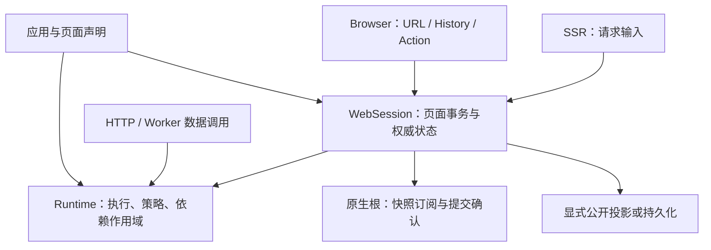

# 从职责与数据模型收敛框架

状态：页面执行的共用声明原型因净增加代码及声明快照回归而否决。模板物化、守卫与 Web 观察者共用已完成实施及验证，见[可行复用实施报告](../../feasible-reuse-report.md)；WebSession 也已完成实施、验证及本地主工作区集成，见 [WebSession 实施报告](../../web-session-report.md)。宿主装配收敛尚未实施。继续保留全部能力、稳定性和性能的目标，不预支尚未获得的减半收益。

## 先修正兼容边界

[此前已确认的设计](2026-09-15-application-boundaries-design.md)明确允许调整公开 API、同步迁移仓库内模板和文档，不要求旧接入兼容。上一轮将每个旧 export 和声明逐字节不变作为整个改写的前提，额外收紧了范围。

本轮保留的是能力、数据隔离、生命周期、类型约束和用户行为。公开接入可以重新设计；每个被删除的入口都要映射到新入口，并完成模板、站点、对抗应用和文档迁移。不能用更名、删测试、丢历史状态或把实现交给应用重写来冒充保留能力。

用户进一步允许从代码复用和共用出发全部调整。因此 API、包边界、类、接口、数据模型及模板布局都可重新划分，不以保留旧分层为前提。复用的验收是同一规则只有一个实现和一个明确所有者；新增配置、生成器、适配代码和消费者迁移都计入成本。

上一轮通用树遍历原型的失败仍然成立，但它只评价了固定原有模型下的算法替换，不足以否定模型和职责边界的重新设计。

## 选择的方向

优先收敛三个边界：**声明如何进入执行、页面状态由谁持有、环境如何驱动同一个页面会话**。目标是删除中间表示、重复订阅和跨对象同步协议，减量应来自这些机制实际消失。

| 方向                       | 实际消除对象                                                                   | 取舍                                                       |
| -------------------------- | ------------------------------------------------------------------------------ | ---------------------------------------------------------- |
| 页面直接在执行作用域内运行 | 页面临时 Operation、二次执行注册、通过 params 对象身份传递页面元数据的 WeakMap | 优先；必须继续执行 app/page policies，共享 Core 的执行规则 |
| 一个 Web 会话持有页面状态  | 控制器快照到视图快照的独立订阅链、保留页面的多次重建索引、会话适配器的转发接口 | 优先；状态提交、原生渲染确认、持久化仍是不同阶段           |
| 更薄的宿主装配计划         | dev/preview/生成入口的部分重复装配、原始代码字符串 hook                        | 次要；当前 SSR 语义已集中，不能预期它带来大幅净减量        |

不引入一个能够解释所有功能的通用引擎。已有的高效树操作、HTTP 流生命周期、平台输出格式继续按各自语义实现。三套原生绑定目前合计只占 `front/src` 的一部分，原生组件树接管也已在上一轮完成，不能再次计作待获得的收益。

## 一、消除页面到 Operation 的中间投影

当前真实链路：

```text
PageControllerDefinition
→ defineWebApp 为每页生成临时 Operation
→ 拼接进 Core app.operations，再建立 WebPlan.operations
→ loadPage 复制 params，将 entryId/retained 写入两个 WeakMap
→ execution.execute 查回临时 Operation
→ consumePage 查 WeakMap / prefetch，再调用真正的 page handler
```

这些额外对象的用途是让页面复用 Core 的策略、上下文与资源作用域。应直接复用这些执行规则，移除中间业务 Operation 身份。

第一版原型进一步共用声明：页面自身满足 Core 可执行声明的契约，直接注册同一引用，不为它生成第二个 Operation。Core handler 增加可选泛型执行元数据，普通操作仍只需 input/context；页面传入独立 PageAttempt。策略与 schema 继续处理原始 params，元数据不能覆盖 handler、策略、provider 或操作注册关系。带元数据的调用不得使用忽略元数据身份的 Core 查询缓存。

候选链路：

```text
页面声明 + 路由，装配为直接关联
→ loadPage 得到可信页面引用与显式 PageAttempt
→ 现有 execution 的内部执行流程
→ app/page policies
→ retained / 一次性 prefetch / handler 或 Controller.perform
→ afterLoad
```

`PageAttempt` 仅包含此次页面加载本来就具有的 `entryId`、保留页面和预取来源。调用关系显式传递这些值，不再依赖 params 对象身份和 `WEB_EXECUTION` 字符串绑定。路由和结构化页面引用共用规范化页面声明索引；不再另建一张“所有页面都变成另一个业务 Operation”的执行表。导航事务把自己的预取 stage 显式传给每次 loadPage，不临时替换共享 execution.bindings 中的缓存。

删除目标集中在 `web/application/definition.ts` 的合成 Operation 循环与 `WebPlan.operations`，`load-page.ts` 的二次查表和 WeakMap 写入，以及 `runtime.ts` 创建的页面元数据旁路。`WebPageOperation` 等仅为这一转换存在的类型也一并迁移。

Core 仍独立于 Web：内部执行原语只理解执行描述、策略和作用域，不导入 Page、Router 或 DOM。它复用已有校验、策略、取消、记录、错误与输出处理；不能复制一套页面执行管线，也不公开任意传入 policies 的逃生口。应用归属和继承策略必须在可信装配边界绑定，业务操作现有的注册引用校验仍要保留。

外部 runtime 仍须支持。defineWebApp 返回的 app 必须包含实际页面声明，调用者用 createRuntime({ app: definition.app }) 即可创建完整运行时；执行继续使用声明引用校验，不以相同 appId 字符串代替归属。外部 runtime 的所有权不转移，Web 默认 provider 仅在缺失时补入正确执行作用域。

必须用以下行为验证这一层真的被消除：预取/保留命中也执行 policy；同参数两个 entry 的预取和草稿不串；取消不进入 Controller fallback；嵌套业务调用继承同一个 trace/signal/provider scope；外部 runtime 不被误释放。

## 二、让 WebSession 成为页面会话的唯一状态所有者

方案编写时，控制器持有 tree、snapshot、pageCache 和失效状态；`createAppView` 又订阅控制器，建立 retained/visible/previous 索引，发布自己的 snapshot 与 revision；持久化再通过 navigation adapter 和 browser session bridge 对接。下述收敛现已实施，具体差异和证据见实施报告。

候选 `WebSession` 是现有职责的收敛点，替换原标准接入中的控制器与独立视图发布层。它不包住全部旧对象继续转发。

```text
WebSession 的已提交状态
├─ navigation：Stack / Tabs / Split 结构
├─ entries：EntryId → 页面结果、ResourceKey、失效信息
├─ mountOrder：原生隐藏页面的稳定挂载顺序
└─ revision：供原生根确认本次呈现

只读投影
├─ native snapshot：可见性、页面实例、导航摘要
├─ public hydration：只允许公开投影后的页面数据
└─ session persistence：导航和显式登记的本地状态
```

这些是一个权威模型的不同边界投影，不是可以混为一份 JSON 的数据。markPublic 的公开字段限制继续适用于 SSR 出站数据；私有页面字段不能因“统一快照”进入 hydration，本地草稿也不能自动上传或成为 SSR 输出。

会话的一次提交同时确定下一棵树、页面保留集合、原生呈现顺序与失效状态，发布一次稳定快照。原生绑定直接订阅它，减少 controller → view 的二次通知和重复索引构建。持久化直接调用会话的 capture/restore 边界，删除 navigation adapter 的转发层；异步存储队列、provider 注册、版本校验、deep-link 门控仍有独立必要性。

错误或拒绝的候选页面不能混入已提交状态；首次错误呈现应有明确结果通道。state 已提交后发生 renderer/observer 错误时，也不能回滚或报告为提交前拒绝。

以下身份和阶段必须继续区分：

- ResourceKey 用于数据复用；EntryId 用于同一页面的多个独立实例。
- 导航取消代次防止过期结果提交；revision/acknowledgement 表示原生 DOM 已呈现。
- PersistenceKey 定位跨重载状态；不能用随机 RuntimeId 替代。
- 状态提交、原生确认、DOM/scroll 恢复、持久化完成具有顺序关系，不能压成一个 `ready` 布尔值。

这项改写不会将组件内部状态搬进框架。React/Vue/Svelte 继续拥有组件树、响应式局部状态和挂载/卸载；框架只保存导航所需身份、页面结果以及应用显式登记的持久化状态。

## 三、宿主通过明确端口驱动会话



Browser 端口拥有 URL 安全判断、history、原生确认等待、DOM/scroll 与页面生命周期事件。SSR 端口提供请求头、Cookie、locale、bindings，并在资源释放前完成 HTML 与 public 数据物化。HTTP 数据接口直接使用 Runtime，不需要构造 WebSession。

Action 继续作为可扩展的应用输入：Flow、modal、ExternalUrl、自定义 handler 和 Compound 的顺序/失败语义都保留。modal 由独立短期页面事务加载后交给应用呈现，共享执行基础设施，不修改主页面 history 或 session。这里收敛的是加载和状态边界，不取消 Action 能力。

部署端只处理平台能力与产物布局。当前 `createSSRHost → createSSRHandler` 已集中请求语义；Vite 不会代替 Node 流处理、Worker waitUntil、平台缓存和各部署平台的目录格式。这部分属于小范围装配收敛，暂不作为主要删码假设。

## 如何证明这一方向有效

先做“页面直接执行”的完整纵向原型，贯通普通 URL、结构化 entry、预取与 retained、独立 HTTP 调用和外部 runtime。迁移一套原生消费者后，旧页面临时 Operation 与两个 WeakMap 必须实际消失；新增内部执行规则、绑定代码和模板迁移全部计入成本。如果仍有两套执行流程或换名后的第二张页面执行表，则该抽象没有成立。

再验证 WebSession 收敛。以现有原生根为消费者，证明 push/pop/tabs/split、同页双实例、隐藏草稿、modal 隔离、迟到导航、history/scroll、刷新恢复、拒绝/重定向和组件类型变化均保持。重点记录每次导航的执行次数、通知次数、页面加载次数和索引分配，而不仅是最终页面看起来相同。

API 变更用“旧能力 → 新入口 → 已迁移消费者 → 行为证据”验收。旧名字和内部 getter 顺序不自动成为新 API 的永久约束；应用可观察行为、类型保障、数据安全和生命周期仍须逐项证明。session/hydration 的版本迁移或明确失效处理也必须计入，不能无声丢掉已有草稿。

当前相关范围为 Web application 976 行、navigation 2,138 行、session 668 行及 Browser 三个编排文件 982 行，共 **4,764 行**。这是需要审查的现有代码规模，不是可删除量。单独这一范围不足以支撑 6,831 行净删除，不能据此承诺达到减半；后续每次原型都要扣除替代实现和消费者迁移成本，再决定是否继续扩大。

## 四、按语义确定共用边界

| 共用对象                  | 唯一所有者及删除对象                                                    | 必须保留的差异                                                    |
| ------------------------- | ----------------------------------------------------------------------- | ----------------------------------------------------------------- |
| 页面与业务操作的执行规则  | Core 现有执行管线；删除合成页面 Operation、WEB_EXECUTION 和两个 WeakMap | 页面预取/保留、业务查询缓存仍有不同身份；元数据不成为策略逃生口   |
| 页面结果与呈现索引        | 已实施 WebSession；删除控制器与视图之间的独立同步协议                   | revision、取消代次、entryId 和 resourceKey 含义不同               |
| 非阻塞观察者通知          | 同步调用、隔离异常、观察异步拒绝可共用一段实现                          | 提交步骤的失败必须汇总；日志 sink 的失败传播不能被一起吞掉        |
| Promise 结算集合          | track/drain 可共用；生命周期所有者决定何时关闭和释放                    | HTTP 消费结束、SSR 物化结束、Container 逆序释放不能统一成一个时点 |
| beforeLoad/afterLoad 守卫 | 同一泛型短路循环，保持前后取消检查                                      | 两阶段输入和首个非 next 结果仍不同                                |
| 模板中立业务源            | 按 full/minimal 各保存一份，生成三个原生消费者                          | 原生 mount/hydrate/SSR 和独立 appId 保留                          |

小机制在主模型收敛后处理，避免先抽象即将删除的代码。不增加通用 TaskManager、事件总线或参数化大引擎。JSON clone、public projection、session 快照和 cache identity 也不能整体合并：目前数组空位、undefined、类实例、错误所有者和公开字段规则并不相同。

六模板逐文件比较发现 full 13 个相同文件、每份 463 行，minimal 11 个相同文件、每份 248 行：重复副本合计 **1,422 行**。可采用构建时公共源码加原生覆盖层，生成的用户应用仍只依赖公开包。这个数字尚未扣除物化器、发布准备和验证脚本成本；它属于模板维护源码，不计入 13,765 行运行时的降幅。原生入口当前很薄，不再新增一个跨 React/Vue/Svelte 的伪运行时来统一它们。

页面执行验证计划见[共用声明原型计划](../plans/2026-09-20-shared-execution-proof.md)，实测见[原型验证报告](../../shared-execution-proof.md)：原型运行源码 13,765 → 13,800 行，852 项测试和 17 项构建通过，但组合声明的 caller mutation 探针失败。该原型未进入主工作区；其失败不能作为其他共用方案也不可行的证明。

后续已落地同义机制复用与模板物化：模板维护源码净减 1,493 行，扣除工具、配置、测试后合计净减 1,159 行，运行时仅净减 5 行。生成应用保持完整独立；具体所有权、边界修复与验证见[实施报告](../../feasible-reuse-report.md)。
